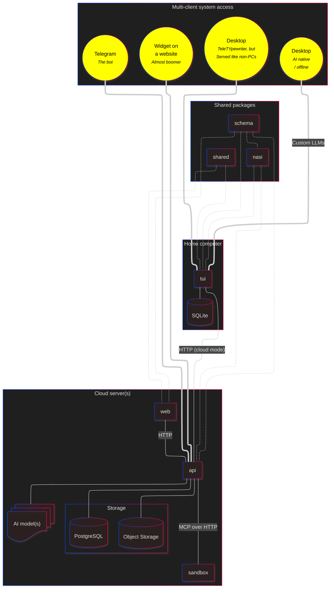

# 가자⛲


[](https://sonarcloud.io/summary/new_code?id=SubZtep_kaja)

> [!IMPORTANT]
> Kaja is still evolving :speaker::godmode::loudspeaker:

Kaja is an AI assistant you talk to from your terminal. Give it a task and it keeps looping with an LLM, using tools and switching personas as needed, until the job is done. Point it at a local model or a cloud one, chat with it in the terminal, on Telegram, or through a widget on your own website.

Under the hood it is a full-stack playground: a **Hono API** secured by **Better Auth**, a **TanStack Start** web app, and a **React Ink** terminal agent. All **TypeScript**, all **Bun**, one repo.

## Install

Download and install the latest release on macOS or Linux:

```bash
curl -fsSL https://kaja.io/install.sh | bash
```

On Windows (PowerShell):

```powershell
irm https://kaja.io/install.ps1 | iex
```

Then run it:

```bash
kaja
```

The first run starts a short setup wizard: sign in to Kaja Cloud, or point it at your own LLM provider and it writes `~/.config/kaja/` for you.

## Run from source

Make sure [Bun](https://bun.com/docs/installation) and [Docker Compose](https://docs.docker.com/compose/install/) are installed.

```bash
# get the source
git clone https://github.com/SubZtep/kaja.git
cd kaja

# install dependencies
bun install

# run lint, typecheck and tests from git hooks
bunx lefthook install

# start services
docker compose up -d

# run the terminal UI
cp apps/tui/.env.example apps/tui/.env
bun dev:tui
```

Working on the API or web app? The [development guide](https://docs.kaja.io/development) covers the env files, `bun dev` and the rest.

> [!TIP]
> If you want to look around **inside the sandbox** container, open a shell:
> ```bash
> docker compose exec sandbox bash
> ```

## What’s inside

**Apps**

- [`api`](./apps/api/)
  - REST API and cloud agent (`/nasi`)
  - Authentication and database migrations
  - Email sending and templates
  - [Widget](./apps/api/widgets/) bundle served to third-party sites
- [`tui`](./apps/tui/)
  - Terminal UI for the AI agent
  - Telegram bot
- [`web`](./apps/web/)
  - Public homepage
  - Admin portal
- [`sandbox`](./apps/sandbox/)
  - Runs stdio MCP servers (a headless Chrome) for cloud turns
  - Keeps each browser to public addresses through its own egress proxy

**Packages**

- [`nasi`](./packages/nasi/) – the agent brain: the loop, tools, and memory
- [`schema`](./packages/schema/) – shared Zod schemas and types
- [`shared`](./packages/shared/) – small pure utilities

### Package diagram



_If you’d like to chat about it, [here I<big>𝕏</big>am](https://x.com/messages/compose?recipient_id=19888096)._

## Documentation

Want the full story? 🐓 Head to **[docs.kaja.io](https://docs.kaja.io)**.
