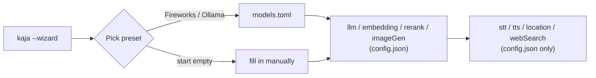

# Kaja CLI  !¡ 🐓

Terminal chat with personas, tools, optional mic dictation, and optional TTS.

## Install

> [!NOTE]  
> Only tested on Linux.

```bash
curl -fsSL https://cli.kaja.io | bash
```

### Uninstall

```bash
rm ~/.local/bin/kaja
```

## Run

```bash
kaja
```

## Screenshots


## Config

```bash
kaja --wizard
```

Runs automatically on first launch or if the config is invalid. Pick a
provider preset (Fireworks AI or Ollama) to prefill credentials and models,
or start empty and fill in everything yourself.

Prefer editing files directly? Config lives in `~/.config/kaja/`:

* [`config.json`](docs/config/config.json) — One required group ( `llm` ) and
  several optional ones ( `embedding` , `rerank` , `imageGen` , `stt` , `tts` ,
  `location` , `webSearch` , `telegram` ). Leaving a group out just disables
  that feature.
* [`mcp.toml`](docs/config/mcp.toml) — Model Context Protocol servers for the agent.
* [`models.toml`](docs/config/models.fireworks.toml) — Every chat/embedding/
  rerank/image-generation model your provider offers, so you can switch
  `llm.model` (or `embedding` / `rerank` / `imageGen` ) without re-entering
  credentials. A template matching your wizard preset is written on first run
  ([Fireworks](docs/config/models.fireworks.toml) /
  [Ollama](docs/config/models.ollama.toml) examples).
* [`personas/`](docs/config/personas) — Preconfigured agent behaviours, one
  `.toml` file per persona (filename minus extension is the persona id, e.g.
  `barkochba.toml` -> `barkochba`). Give a persona a `when` clause and Kaja
  switches to it on its own when the conversation calls for it.

<details>
<summary>How the wizard and models.toml fit together</summary>



`models.toml` is the catalog; the wizard copies your preset's credentials and
first matching model into `config.json`'s `llm`/`embedding`/`rerank`/
`imageGen` groups. Everything else ( `stt` / `tts` / `location` / `webSearch` )
has no models.toml equivalent — enter it directly in the wizard or by hand.

</details>

### Where to get credentials?

* **OpenAI API** (`llm`) : any compatible LLM (e.g. MiniMax M3) with REST API works (e.g. Ollama, Fireworks AI).
* **Web search** (`webSearch`) : get a free key from [Brave's website](https://brave.com/search/api/).
* **Location** (`location`) : the example URL and API key work for a while.

### Language

English or Magyar, covering the UI and the assistant's replies. The setup wizard ( `kaja --wizard` ) starts with a language picker, saved as `settings.language` and read once at startup; without a saved choice the system locale decides (a Hungarian locale → Magyar, anything else → English).

Voice caveat for Hungarian: dictation needs the multilingual whisper model on the STT server (the English default is an English-only model; 

set `stt.model` / `stt.language` in the config file to override), and spoken replies stay with the configured Kokoro voice (no Hungarian voice) unless `tts.model` / `tts.voice` point somewhere Hungarian-capable.

## Personas

Each `.toml` under `~/.config/kaja/personas/` is one behaviour: a `label`, the
`instructions` that become the system prompt, and optionally a `model` to pin,
`dataset` to collect, and sampling params.

Switching is automatic. Add a `when` clause describing the persona's territory
and Kaja moves itself there mid-conversation when the topic clearly matches:

```toml
label = "Self-care companion"
when = "the user talks about their day, feelings, mood, or personal struggles"
instructions = """..."""
```

Every persona with a `when` is offered to the model as a switch target, so
mentioning your day can hand the conversation to the self-care companion, and
asking for a guessing game can hand it to the barkochba guesser — no command
needed. The switch is announced in the timeline as it happens. Personas without
a `when` are never auto-selected; pick those from the slash menu — note that
picking one there starts a fresh conversation, while an automatic switch keeps
the current one going. A persona that pins a `model` swaps the model too;
otherwise the current one is kept.

## Voice & dictation

Voice features (the optional `stt` / `tts` config groups) need [speaches](https://speaches.ai) for STT/TTS and `ffmpeg` / `ffplay` for mic and playback.

## Telegram

Chat with Kaja from Telegram instead of the terminal, reusing the same
personas, tools and models:

```bash
kaja telegram
```

Runs a long-polling bot until you stop it (Ctrl+C). The wizard doesn't cover
this — add a `telegram` group to `config.json` by hand:

```json
"telegram": {
  "botToken": "123456789:AAH...",
  "allowedUserIds": [YOUR_NUMERIC_ID]
}
```

Get `botToken` from [@BotFather](https://t.me/BotFather) ( `/newbot` ) and your
numeric id from [@userinfobot](https://t.me/userinfobot) — the allowlist takes
user ids, not `@usernames`, and messages from anyone else are ignored. Since
the bot can run tools, treat it as granting whoever is on that list the same
reach the terminal app has; shell commands come back as approve/decline
buttons. See the [setup guide](docs/telegram.md) for the full walkthrough.

## Develop

```bash
bun install
bun start
```

### Test / lint

```bash
bun test
bun lint # write immediately
```

<!-- ## Hotkeys

### Input field

| Key | Action |
|-----|--------|
| Enter | send message |
| Shift+Enter / Alt+Enter / Ctrl+Enter / Ctrl+J | insert newline |
| ↑ / ↓ | move cursor between lines (sticky column) |
| ← / → | move cursor by character |
| Ctrl+← / Ctrl+→ (or Alt+←/→) | jump by word |
| Home / End | start / end of current line |
| `/` on empty input | open menu |
| Ctrl+T | toggle mic dictation |

### Chat scrolling

| Key | Action |
|-----|--------|
| Mouse wheel | scroll chat |
| PageUp / PageDown | scroll by a page |
| Ctrl+↑ / Ctrl+↓ | scroll by a few lines |
| Ctrl+Home | jump to oldest message |
| Ctrl+End | jump to newest & follow |

### Menu

| Key | Action |
|-----|--------|
| ↑ / ↓ | move selection |
| Enter | select |
| Esc / Backspace | close menu |

### App

| Key | Action |
|-----|--------|
| Esc | quit (closes menu first if open) |
| Ctrl+C | quit |

## Prompt indicator

| Mark | Meaning |
|:----:|---------|
| >    | ready to type |
| *    | mic on, idle |
| o    | recording |
| ~    | transcribing |
| x    | muted while agent speaks | -->
