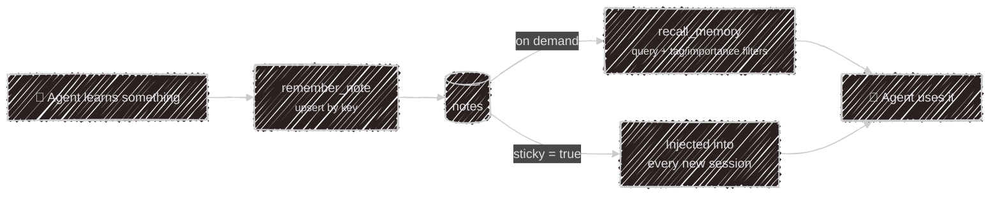

# Memory & datasets

Two different kinds of remembering, both kept in the same store: a [SQLite file](/configuration/storage)
locally, Postgres in the cloud.

| | **Notes** | **Datasets** |
|---|---|---|
| Shape | free-form facts | a fixed list of fields |
| Written by | the agent, unprompted | the user, one answer at a time |
| Read back | by search (`recall_memory`) | as a completed version |
| Defined where | nowhere — grows organically | `marketplace/datasets/*.json` |

## Notes

The agent writes notes proactively whenever it learns something durable about you or your work —
it doesn't ask permission first.

Each note has a **key** (a stable id like `user:communication-style`), the **content**, an
**importance** of `low`/`medium`/`high` that weights recall ranking, optional **tags**, and a
**sticky** flag.

Notes belong to whoever is talking: the terminal, each Telegram user and, in the cloud, each widget visitor
keep separate sets, so a visitor's notes never reach your own chats or another visitor.



| Tool | What it does |
| --- | --- |
| `remember_note` | write or update a fact — **upserts by key**, so calling again with the same key overwrites rather than duplicating |
| `recall_memory` | search notes; filters by tags, minimum importance, or sticky-only |
| `list_notes` | enumerate what's stored |
| `forget_note` | delete one note by key, or every note carrying a tag |

**Sticky** notes skip the search step entirely — they're injected into the system prompt at the
start of every session. Use them for the handful of things that should always be in context; leave
everything else non-sticky so it's recalled only when relevant.

You can ask for any of this in plain language: *"what do you remember about me?"*, *"forget the
note about my old job"*.

## Datasets

A dataset is a questionnaire the agent fills in conversationally, across as many sessions as it
takes. Datasets are [abilities](/abilities): one JSON file per topic in
`~/.config/kaja/marketplace/datasets/`, synced or your own. A [persona](/abilities/personas) opts into one with
`dataset = "<id>"`. Every dataset in the folder loads, but does nothing until a persona names it or it's
a profile.

```json
{
  "label": "Mood check-in",
  "revalidateAfterDays": 7,
  "fields": [
    { "name": "mood", "prompt": "How has your week felt overall?" },
    { "name": "energy", "prompt": "How's your energy been?", "accepted": ["low", "okay", "high"] }
  ]
}
```

| Field | Purpose |
| --- | --- |
| `label` | display name (required) |
| `fields[].name` | the stored key (required) |
| `fields[].prompt` | what to ask — the agent rephrases it naturally rather than reading it out |
| `fields[].accepted` | fixed answer list; anything else is rejected case-insensitively and re-asked |
| `revalidateAfterDays` | how long a completed set stays fresh before a new version is started |
| `profile` | it's about the user: every persona sees the answers (see below) |

### The onboarding profile

The shipped `onboarding` dataset is a profile: what to call you, pronouns, age, look, where you
live, languages, work, interests, household, pets and diet. The `onboarding` persona walks you
through it, but only the name matters; every other question is fine to skip, and a skipped one is
recorded as `prefer not to say` so it's never asked again.

Because it's a profile, every persona gets an "About the user" section in its system prompt with
what you shared (never the skipped fields), and records a missing detail when you happen to mention
it, without quizzing you for the rest. While your name is still unknown, the assistant asks for it
once, kindly. Like [sticky notes](#notes), the section goes to the model provider with each message.

### Versions

Answers are grouped into **versions**. When a set is complete it's stamped with a completion time;
once `revalidateAfterDays` has passed, the next check transparently opens a fresh version and the
agent asks everything again. That's what makes a mood or check-in questionnaire useful over time —
each version is a dated snapshot you can compare against the last.

The agent drives all of this through one tool, `dataset_info`, with four actions:
`list_datasets`, `get_status` (progress, and what's still unanswered), `answer` (record one field),
and `start_new_version` (redo the set early, when you ask).

---

Next:

[Configuration](/configuration){: .btn .btn-green .fs-5 }
