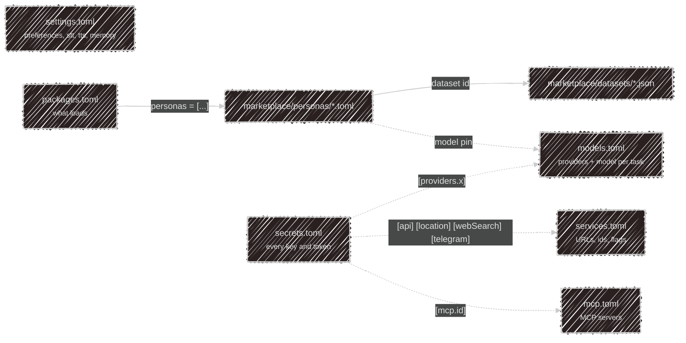

# Configuration

Everything on this page is **[local mode](/modes) only** — cloud mode reads no config files at
all, apart from a minimal `settings.toml` holding your UI language.

LLM provider credentials, model-to-task mapping, secrets, services, and preferences live in
`~/.config/kaja/`, alongside the marketplace's [personas](/personas) and their
[datasets](/memory#datasets).

```ini
~/.config/kaja/
├─ marketplace/     # skills, personas, datasets, HTTP tools and MCP servers, synced and your own
├─ tools/*.ts       # your own plugin tools
├─ mcp.toml         # model context protocol servers
├─ models.toml      # model catalog per provider
├─ packages.toml    # which of them are loaded
├─ services.toml    # external service definitions and endpoints
├─ secrets.toml     # your secret keys and tokens
└─ settings.toml    # preferences and app settings
```

Run `kaja config paths` to print the resolved location of each of these on your machine — the
directory follows XDG, so `$XDG_CONFIG_HOME/kaja` when set.

The first `kaja --local` run seeds these from the templates in
[`docs/config`](https://github.com/SubZtep/kaja/tree/main/docs/config). `kaja config fetch`
later downloads the current admin-managed defaults (model catalog, MCP servers) from
the cloud API's `GET /config/export` and rewrites `models.toml`/`mcp.toml`
from that, backing up anything you'd changed; with no network (or `--offline`), it falls back to
the same bundled templates as first run. `kaja config diff` shows what a fetch would change
without writing anything, and `kaja config wizard` re-runs the interactive first-run setup at any
time (language, provider). `secrets.toml`, `services.toml`, and `settings.toml` are never touched
by `fetch` — those stay yours to hand-edit. Personas, like the rest of the marketplace, come from
`kaja pkg update` instead.

## Which file does what



`secrets.toml` is the only file that holds credentials — the others stay safe to share, commit, or
paste into a bug report.

## Checking keys and tokens

`kaja doctor` tests every credential your config relies on: model providers, HTTP tool and MCP
packages, MCP servers that list `secrets`, and the location, Telegram and web search services. In a terminal it
asks for anything missing or not working, tests the new value before saving it to `secrets.toml`,
and only keeps a value that fails its test if you say so. A provider without a key is fine as long
as its model answers (Ollama needs none). It ends with what's still left to fix and where.

## Editor support

JSON Schemas for every one of these files ship in
[`docs/config/schemas`](https://github.com/SubZtep/kaja/tree/main/docs/config/schemas). Install the
recommended VSCode TOML extension and you get completion and validation while editing.

---

Next:

[Settings](/configuration/config){: .btn .btn-green .fs-5 }
