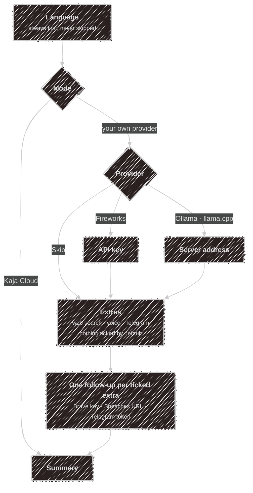
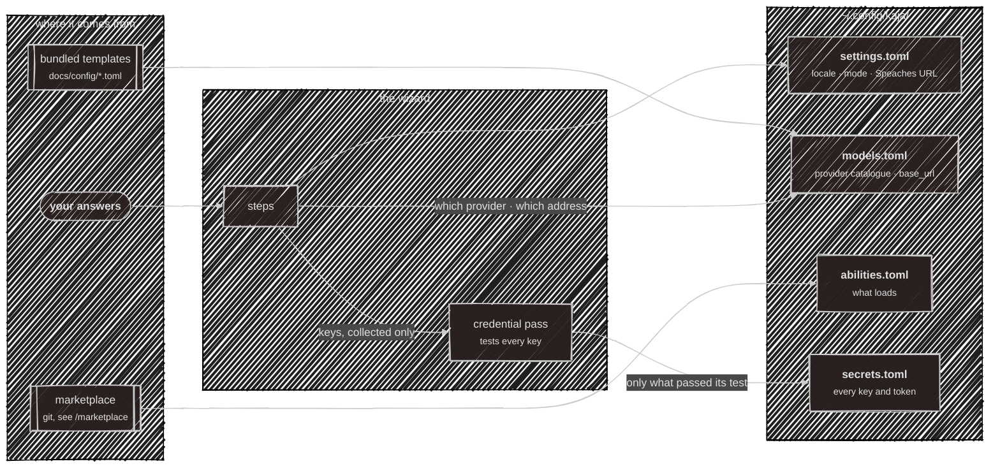
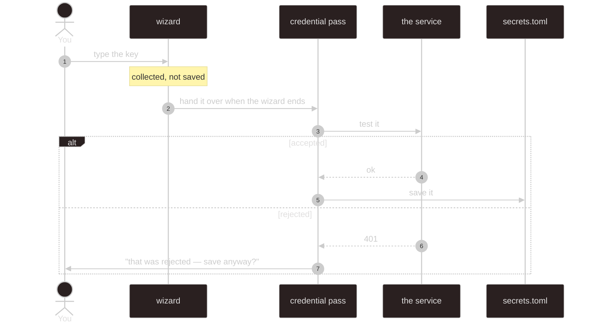
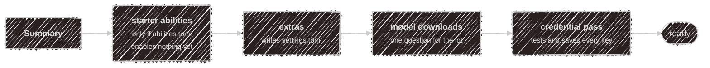

# Setup wizard

The wizard is the only thing that writes config on your behalf. It runs by itself on a first
`kaja --local` (no `settings.toml` yet, in a terminal), and `kaja config wizard` re-runs it whenever
you want. Nothing it writes is special: every file it produces is a plain TOML file you can hand-edit
afterwards, and every step opens on what you already have, so holding <kbd>Enter</kbd> walks a
configured machine through unchanged.

Depending on your answers it shows between **three and nine screens** — the summary included. Cloud
is three.

## The questions

A step is skipped whenever it can't apply — cloud needs no provider, a provider that runs on your
machine takes an address rather than a key, and an extra you didn't tick is never followed up.



Language comes first because every question after it is only answerable by someone who can read it —
picking one switches the rest of the wizard into that language immediately.

<kbd>Esc</kbd> on a list cancels the whole wizard. On a typed answer, an empty <kbd>Enter</kbd> skips
just that one.

## Where each answer ends up

This is the part worth knowing: your answers fan out into four different files, and one of them
(`secrets.toml`) is never written directly by the wizard at all.



Step by step:

| You answer | It becomes | In |
| --- | --- | --- |
| Language | `[preferences] locale` | `settings.toml` |
| Mode | `[preferences] mode` | `settings.toml` |
| Provider | a copy of `models.<provider>.toml` | `models.toml` |
| Provider API key | `[providers.<name>] api_key` | `secrets.toml` |
| Server address | `[providers.<name>] base_url` | `models.toml` |
| Web search key | `[webSearch] apiKey` | `secrets.toml` |
| Speaches URL | `[stt] speachesUrl` (as `ws://`), `[tts] speachesUrl` (as `http://`) | `settings.toml` |
| Telegram bot token | `[telegram] botToken` | `secrets.toml` |

The model templates are the same files that document [`models.toml`](/configuration/models) on this
site, compiled into the binary — so a first run needs no network. Writes are appends and single-line
edits rather than a parse-and-re-serialise, which is why the templates' commented-out examples
survive being configured.

One answer can land in two places: you give the Speaches server's address once, and it's written to
`[stt]` as `ws://` and to `[tts]` as `http://`, because [voice](/configuration/voice) in talks to the
realtime WebSocket API and voice out to the plain HTTP one.

## Keys take the long way round

You type a key the moment its question is on screen, but it does **not** go straight to disk. The
wizard only collects it; the same pass `kaja doctor` runs tests it first, and writes it only if the
service accepts it.



Two consequences worth knowing:

- **A key is never saved untested.** If it's rejected you're told why, and it's only written if you
  insist.
- **A key you skip is not asked for twice.** The wizard tells the pass you already declined, so it's
  listed as still to do instead of being asked again a minute later.

The summary screen lists what happened to each key — entered, already saved and kept, or skipped — but never shows the key itself.

The pass also asks for anything only the finished config reveals — an [ability's](/marketplace) key,
an [MCP server's](/tools) declared secret — because those aren't knowable until `abilities.toml`
exists.

## After the last question

Answering the summary isn't the end; four things run before you get your prompt back. This is why
keys are collected up front rather than asked for here, at the end of a minute of work.



- **Starter abilities.** Everything from the [marketplace](/marketplace) that needs no key and runs
  no command on your machine, turned on without asking — there's nothing to weigh up. It only
  happens when `abilities.toml` enables nothing yet, so a machine you've curated is left alone.
  `kaja abilities` is where you choose among the rest.
- **Model downloads.** If your server is Ollama and hasn't got the models `models.toml` names, you
  get **one** question covering all of them, not one per model. A server that isn't Ollama — or
  isn't running — is skipped silently, so the question only appears when it can be acted on. It runs
  before the credential pass so the provider test meets a model that's really there.
- **Credential pass.** As above. Ends with a count of anything still unresolved.

## Cloud mode is three questions

Kaja Cloud keeps your settings in your account, so there is nothing on disk to configure. The wizard
writes a minimal `settings.toml` — your language and `mode = "cloud"`, no `[stt]`, `[tts]` or
`[memory]` — and stops.

```
language → mode → summary
```

Then sign in with `kaja`. Abilities, personas and models are all chosen on the web; see
[modes](/modes) for what each one keeps where.

## What it never touches

- **`mcp.toml`** and your own `tools/*.ts` — yours to hand-edit.
- **`abilities.toml` on a machine that already has abilities on** — see above.
- **Anything at all, in cloud mode, beyond `settings.toml`.**
- **The admin-managed model list.** The wizard used to offer to fetch it and no longer does — it
  means nothing on a fresh personal machine. [`kaja config fetch`](/configuration) still downloads
  it, and `kaja config diff` still shows what it would change.

## When there's no terminal

Non-interactive stdin or `--headless` can't answer a prompt, so the wizard writes the bundled
templates untouched and asks nothing. Everything above still applies the next time you run it
properly.
