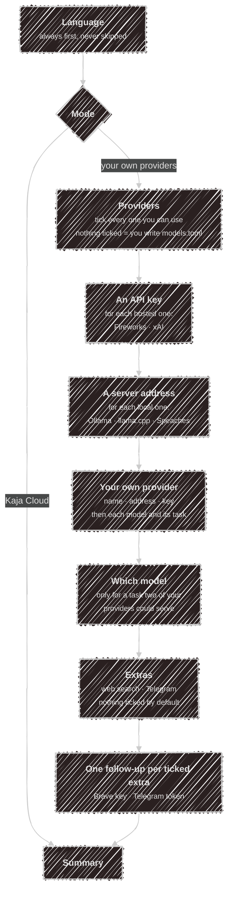
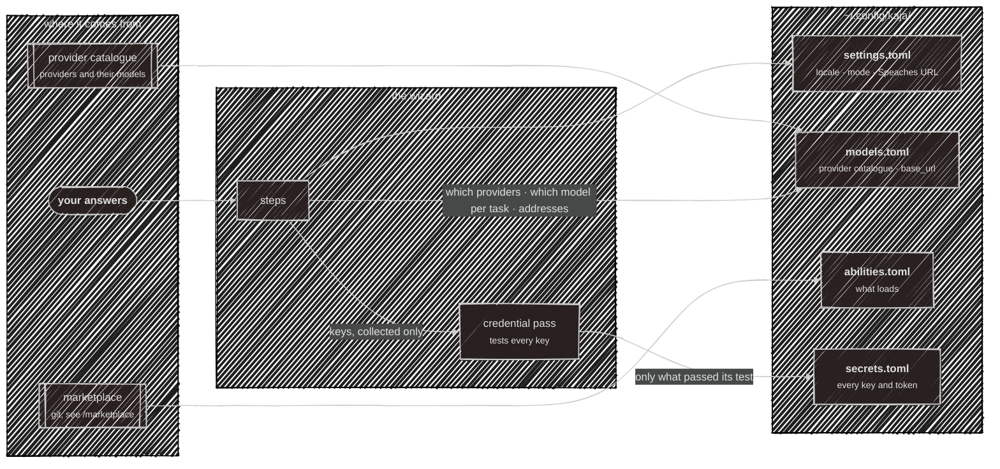
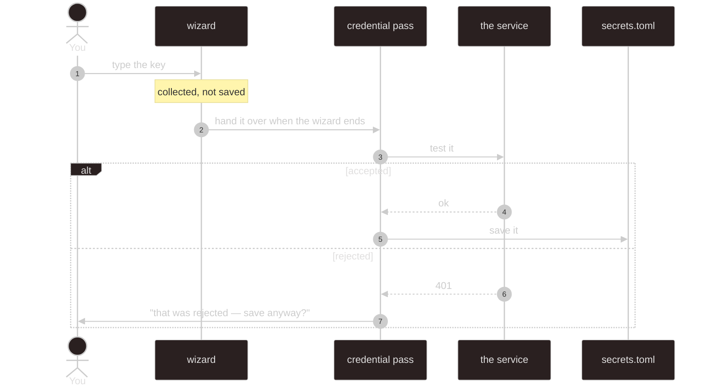

# Setup wizard

The wizard is the only thing that writes config on your behalf. It runs by itself on a first
`kaja --local` (no `settings.toml` yet, in a terminal), and `kaja config wizard` re-runs it whenever
you want. Nothing it writes is special: every file it produces is a plain TOML file you can hand-edit
afterwards, and every step opens on what you already have, so holding <kbd>Enter</kbd> walks a
configured machine through unchanged.

Cloud is **three** questions. Your own providers ask one more question per provider you tick, plus
one per task that two of them could serve. Each answer stays on screen as a `✓` line and the next question opens below
it, so the wizard reads top to bottom instead of replacing one box with the next.

## The questions

A step is skipped whenever it can't apply — cloud needs no providers, a provider that runs on your
machine takes an address rather than a key, a model is only asked about where two of your providers
overlap, and an extra you didn't tick is never followed up. Nothing is tested while you answer, so
you can move through quickly; the checking happens afterwards.



Language comes first because every question after it is only answerable by someone who can read it —
picking one switches the rest of the wizard into that language immediately.

**Custom** is for any other OpenAI-compatible server (LM Studio, vLLM, a proxy of your own). It asks
what to call it, its base URL (a wrong one is refused on the spot), an optional key, and then each
model's id and what it's used for — one after another until you press <kbd>Enter</kbd> on an empty
one. Its models join the pick-a-model questions like any other provider's. There is room for one
custom provider; add more by hand in [`models.toml`](/configuration/models).

Speech in and out is not a separate question: **Speaches** is one of the providers you can tick, and
it brings its speech-to-text and text-to-speech models with it.

<kbd>Esc</kbd> on a list cancels the whole wizard. On a typed answer, an empty <kbd>Enter</kbd> skips
just that one.

## Where each answer ends up

This is the part worth knowing: your answers fan out into four different files, and one of them
(`secrets.toml`) is never written directly by the wizard at all.



Step by step:

| You answer | It becomes | In |
| --- | --- | --- |
| Language | `[preferences] locale` | `settings.toml` |
| Mode | `[preferences] mode` | `settings.toml` |
| Providers you tick | a `[providers.<name>]` table and its models | `models.toml` |
| Which model, per task | the entry named after the task, `[models.chat]`; the others as `[models.<provider>-chat]` | `models.toml` |
| A custom provider | its own `[providers.<name>]` table and a `[models.*]` entry per model | `models.toml` |
| A provider's API key | `[providers.<name>] api_key` | `secrets.toml` |
| A server address | `[providers.<name>] base_url` | `models.toml` |
| Web search key | `[webSearch] apiKey` | `secrets.toml` |
| Speaches address | `[stt] speachesUrl` (as `ws://`), `[tts] speachesUrl` (as `http://`) | `settings.toml` |
| Telegram bot token | `[telegram] botToken` | `secrets.toml` |

`models.toml` is written from the providers you ticked: the catalogue is built into the binary, so a
first run needs no network, and it says the same as the examples that document
[`models.toml`](/configuration/models) on this site. Where two of your providers can serve a task, the
one you pick is the model Kaja uses, and the other stays in the file beside it — a persona can pin it,
and `kaja doctor` can switch to it if your pick stops working. Re-running the wizard rewrites
`models.toml` from your answers, so keep hand-edits in a copy if you make them; nothing ticked leaves
the file exactly as it is.

One answer can land in two places: you give the Speaches server's address once, and it's written to
`[stt]` as `ws://` and to `[tts]` as `http://`, because [voice](/configuration/voice) in talks to the
realtime WebSocket API and voice out to the plain HTTP one. Running the wizard again with a new
address updates both.

## Keys take the long way round

You type a key the moment its question is on screen, but it does **not** go straight to disk. The
wizard only collects it; the same pass `kaja doctor` runs tests it first, and writes it only if the
service accepts it.



Two consequences worth knowing:

- **A key is never saved untested.** If it's rejected you're told why, and it's only written if you
  insist.
- **A key you skip is not asked for twice.** The wizard tells the pass you already declined, so it's
  listed as still to do instead of being asked again a minute later.

The line an answered key leaves behind says what happened to it — entered, already saved and kept, or skipped — but never shows the key itself. The closing screen only lists the files Kaja will use.

The pass also asks for anything only the finished config reveals — an [ability's](/marketplace) key,
an [MCP server's](/tools) declared secret — because those aren't knowable until `abilities.toml`
exists.

## After the last question

Answering the summary isn't the end; a few things run before you get your prompt back. This is why
keys are collected up front rather than asked for here, at the end of a minute of work.

```mermaid
---
config:
  look: handDrawn
  theme: neo-dark
---
flowchart LR
    S["<b>Summary</b>"] --> W["<b>models.toml</b><br><small>and the Speaches address<br>in settings.toml</small>"]
    W --> A["<b>starter abilities</b><br><small>only if abilities.toml<br>enables nothing yet</small>"]
    A --> E["<b>extras</b><br><small>hand their keys<br>to the credential pass</small>"]
    E --> D["<b>model downloads</b><br><small>one question for the lot</small>"]
    D --> C["<b>credential pass</b><br><small>tests and saves every key</small>"]
    C --> M["<b>model check</b><br><small>tries every model, offers<br>a working one when one fails</small>"]
    M --> R(["ready"])
```



- **Starter abilities.** Everything from the [marketplace](/marketplace) that needs no key and runs
  no command on your machine, turned on without asking — there's nothing to weigh up. It only
  happens when `abilities.toml` enables nothing yet, so a machine you've curated is left alone.
  `kaja abilities` is where you choose among the rest.
- **Model downloads.** If your server is Ollama and hasn't got the models `models.toml` names, you
  get **one** question covering all of them, not one per model. A server that isn't Ollama — or
  isn't running — is skipped silently, so the question only appears when it can be acted on. It runs
  before the credential pass so the provider test meets a model that's really there.
- **Credential pass.** As above. Ends with a count of anything still unresolved.
- **Model check.** The same check `kaja doctor` runs: every model you set up is tried once, with the
  reason next to any that fails. This is where a wrong key or a server that isn't running shows up —
  nothing was tested while you answered. If a task's model fails and another model for that task
  answered, you're asked whether to switch to it right there. Failures are counted in the closing
  line.

## Cloud mode is three questions

Kaja Cloud keeps your settings in your account, so there is nothing on disk to configure. The wizard
writes a minimal `settings.toml` — your language and `mode = "cloud"`, no `[stt]`, `[tts]` or
`[memory]` — and stops.

```
language → mode → summary
```

Then sign in with `kaja`. Abilities, personas and models are all chosen on the web; see
[modes](/modes) for what each one keeps where.

## What it never touches

- **`mcp.toml`** and your own `tools/*.ts` — yours to hand-edit.
- **`abilities.toml` on a machine that already has abilities on** — see above.
- **Anything at all, in cloud mode, beyond `settings.toml`.**
- **The admin-managed model list.** The wizard used to offer to fetch it and no longer does — it
  means nothing on a fresh personal machine. [`kaja config fetch`](/configuration) still downloads
  it, and `kaja config diff` still shows what it would change.

## When there's no terminal

Non-interactive stdin or `--headless` can't answer a prompt, so the wizard writes the bundled
templates untouched and asks nothing. Everything above still applies the next time you run it
properly.
