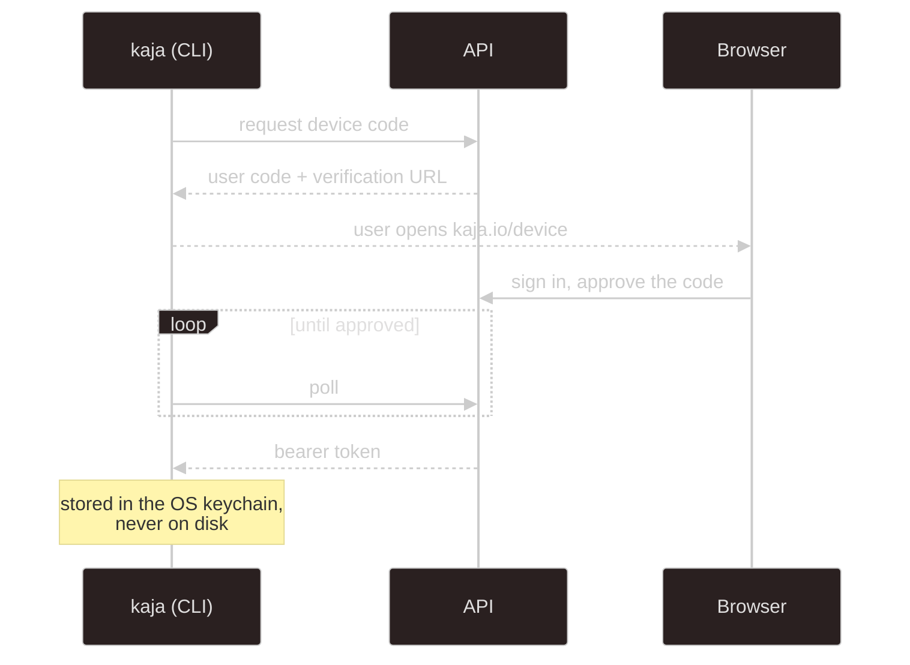

# apps/api

A Hono app with `@hono/zod-openapi` routes, PostgreSQL over the `pg` driver (raw parameterized SQL,
no ORM), and Better Auth for everything account-shaped.

In development the full OpenAPI reference is served at
[`localhost:3001/reference`](http://localhost:3001/reference) — that's the authoritative,
always-current list. This page is the map.

## Mounts

| Prefix | Auth | What |
| --- | --- | --- |
| `/auth/*` | Better Auth | sign-up, sign-in, verification, password reset, device authorization |
| `/users/me` | session | the signed-in user |
| `/admin/*` | session + `admin` role | MCP servers, providers, models, marketplace sync |
| `/widget/admin/*` | session | list, create, and delete [widget](/widget) keys |
| `/packages`, `/packages/skill/{name}` | none | the marketplace catalog (skills, personas, HTTP tools, MCP servers) |
| `/packages/me/*` | session | the user's own packages and their write-only API keys |
| `/nasi/*` | bearer | cloud agent — turns and sessions |
| `/widget/<key>.js`, `/widget/turn` | widget key + Origin | the public embed |
| `/config/*` | shared secret | model resolution for tooling |
| `/health` | none | liveness |
| `/reference` | none | OpenAPI UI, development builds only |

## Cloud agent — `/nasi`

The endpoints the CLI uses in [cloud mode](/modes). All require a bearer token from device login.

| Method | Path | Purpose |
| --- | --- | --- |
| `POST` | `/nasi/turn` | run one turn, buffered — returns the whole response |
| `POST` | `/nasi/turn/stream` | the same turn as SSE, with token deltas and a heartbeat |
| `GET` | `/nasi/info` | which persona, model, and tools this account resolves to |
| `GET` | `/nasi/sessions` | list this user's conversations |
| `GET` | `/nasi/sessions/{id}` | one conversation's metadata |
| `DELETE` | `/nasi/sessions/{id}` | delete a conversation |

Turn requests and responses are the `@kaja/schema/nasi` contracts — see
[Agent brain](/development/nasi#turn-statuses) for the status values and how `session` threads a
conversation together. Both turn routes are rate-limited **per user id**, not per IP, so a shared
NAT doesn't starve everyone.

## Packages and keys — `/packages`

| Method | Path | Purpose |
| --- | --- | --- |
| `GET` | `/packages` | the catalog; personas include their label, `when` and instructions (never `default`, which is always on); HTTP tools and MCP servers their host, key need and tools. Datasets are synced too but never listed: they come with the personas that use them |
| `GET` | `/packages/me` | the user's packages, which ones have a saved key, and whether keys can be saved |
| `PUT` / `DELETE` | `/packages/me/{type}/{name}` | turn a skill, persona, tool or MCP server on or off (`key_required` until one that needs a key has it; 400 for the `default` persona) |
| `PUT` / `DELETE` | `/packages/me/{tool\|mcp}/{name}/key` | save (and test) or remove a key |

Keys live in `user_secret`, AES-256-GCM encrypted with `USER_SECRET_KEY`; the user id and the name
are the cipher's associated data, so a row copied to another user doesn't decrypt. No endpoint
returns a key. Without `USER_SECRET_KEY` the key routes answer 503 and packages that need a key are
left out of the catalog and of turns.

## Auth

Better Auth handles email/password with verification and reset, admin roles, and the **device
authorization grant** the CLI uses. Session cookies are prefixed `kaja`; the CLI holds a bearer
token instead.

## Fail-closed config routes

`/config/*` is authenticated by a shared secret (`CONFIG_API_TOKEN`), not a user session, because
it can return provider API keys. A missing or empty token denies **every** request on the prefix —
misconfiguration locks the door rather than opening it.

## Conventions

- routes are declared with `@hono/zod-openapi` and schemas from [`@kaja/schema/api`](/development/schema)
- SQL is raw and parameterized; user input is never interpolated
- DB row shapes stay private inside `services/`, mapped to API types by private `#rowTo…` helpers
- migrations in `apps/api/migrations/` are additive and lexicographically ordered — they run
  automatically only on a **first** PostgreSQL boot, so an existing volume needs
  `./scripts/db_migration.sh`

## Emails

Templates are React Email components under `src/emails/`. Locally, MailDev catches everything at
[localhost:1080](http://localhost:1080) so nothing leaves the machine.

---

Next:

[Web](/development/web){: .btn .btn-green .fs-5 }
