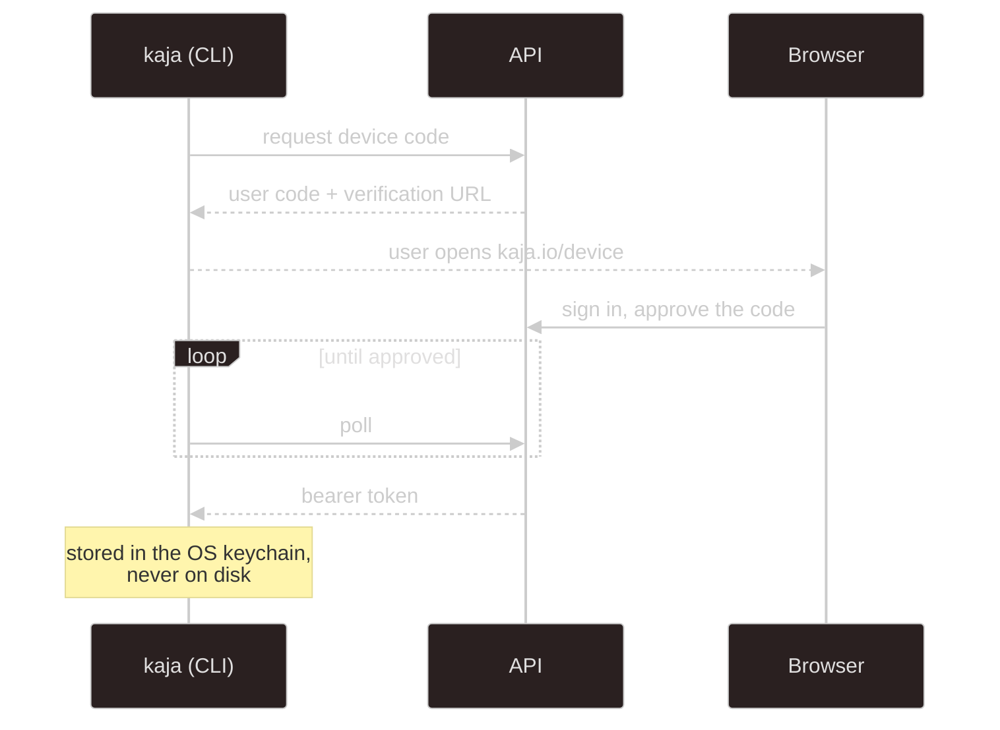

# apps/api

A Hono app with `@hono/zod-openapi` routes, PostgreSQL over the `pg` driver (raw parameterized SQL,
no ORM), and Better Auth for everything account-shaped.

In development the full OpenAPI reference is served at
[`localhost:3001/reference`](http://localhost:3001/reference) — that's the authoritative,
always-current list. This page is the map.

## Mounts

| Prefix | Auth | What |
| --- | --- | --- |
| `/auth/*` | Better Auth | sign-up, sign-in, verification, password reset, device authorization |
| `/admin/*` | session + `admin` role | providers, models, marketplace sync |
| `/widget/admin/*` | session | list, create, edit and revoke [widget](/widget) keys |
| `/abilities`, `/abilities/skill/{name}` | none | the marketplace catalog (skills, personas, HTTP tools, MCP servers) |
| `/abilities/me/*` | session | the user's own abilities and their write-only API keys |
| `/nasi/*` | bearer | cloud agent: turns, sessions, and the persona catalog |
| `/stats` | session | the signed-in user's own [usage numbers](#usage-stats--stats) |
| `/telegram/admin/link` | session | start linking a Telegram account to the cloud bot (`POST`, returns a one-time deep link) |
| `/widget/<key>.js`, `/widget/turn` | widget key + Origin | the public embed |
| `/config/models` | shared secret | model resolution for tooling |
| `/config/export` | none | the model defaults that `kaja config fetch` downloads |
| `/health` | none | liveness |
| `/reference` | none | OpenAPI UI, development builds only |

## Cloud agent — `/nasi`

The endpoints the CLI uses in [cloud mode](/modes). All require a bearer token from device login.

| Method | Path | Purpose |
| --- | --- | --- |
| `POST` | `/nasi/turn` | run one turn, buffered — returns the whole response |
| `POST` | `/nasi/turn/stream` | the same turn as SSE, with token deltas and a heartbeat |
| `GET` | `/nasi/info` | which persona, model, and tools this account resolves to |
| `GET` | `/nasi/personas` | every persona in the catalog (id and label, `default` first), for pickers like the widget page's |
| `GET` | `/nasi/sessions` | list this user's conversations |
| `GET` | `/nasi/sessions/{id}` | one conversation's metadata |
| `DELETE` | `/nasi/sessions/{id}` | delete a conversation |

Turn requests and responses are the `@kaja/schema/nasi` contracts — see
[Agent brain](/development/nasi#turn-statuses) for the status values and how `session` threads a
conversation together. Both turn routes are rate-limited **per user id**, not per IP, so a shared
NAT doesn't starve everyone.

## Abilities and keys — `/abilities`

| Method | Path | Purpose |
| --- | --- | --- |
| `GET` | `/abilities` | the catalog; personas include their label, `when` and instructions (never `default`, which is always on); HTTP tools and MCP servers their host, key need and tools. Datasets are synced too but never listed: they come with the personas that use them |
| `GET` | `/abilities/me` | the user's abilities, which ones have a saved key, and whether keys can be saved |
| `PUT` / `DELETE` | `/abilities/me/{type}/{name}` | turn a skill, persona, tool or MCP server on or off (`key_required` until one that needs a key has it; 400 for the `default` persona) |
| `PUT` / `DELETE` | `/abilities/me/{tool\|mcp}/{name}/key` | save (and test) or remove a key |

Keys live [encrypted in `user_secret`](/development/database#accounts-and-access); no endpoint returns
one. Without `USER_SECRET_KEY` the key routes answer 503 and abilities that need a key are
left out of the catalog and of turns.

## Usage stats — `/stats`

`GET /stats?days=30&tz=Asia/Tokyo` (`days` 1–365; `tz` an IANA timezone, UTC when left out) returns the signed-in
user's own activity for the [dashboard](/development/web#signed-in): totals, one entry per calendar day in `tz`
(the web app sends the viewer's own timezone; the database keeps UTC instants either way), sessions per channel (web or CLI, Telegram, widget), and per-tool calls with
how often they asked first, failed and how long they took. It is computed from the `nasi_message` and
`nasi_tool_call` rows, so tokens, latencies and per-reply numbers only exist for replies saved after they were
recorded.

## Auth

Better Auth handles email/password with verification and reset, admin roles, and the **device
authorization grant** the CLI uses. Session cookies are prefixed `kaja`; the CLI holds a bearer
token instead.

### Rate limits and the visitor's IP

The API's own limiters and Better Auth's both key on the client IP from `X-Forwarded-For`, which the
reverse proxy sets to whoever opened the connection. The web's server-side session check (`getSession`
in `apps/web/src/lib/session.ts`) goes back out through that proxy, so to the API every page render
looks like it came from the web host, and all visitors end up sharing one bucket.

To avoid that, the web sends the visitor's IP in `x-kaja-client-ip` together with the shared `SSR_SECRET`
in `x-kaja-ssr-secret`. When the secret matches, `core/ssr-client-ip.ts` uses that IP for the Hono
limiters and rewrites `X-Forwarded-For` before the request reaches Better Auth. The two headers are
always stripped, and without a matching secret they're ignored, so nobody outside can pick their own
bucket.

## Fail-closed config routes

`/config/models` is authenticated by a shared secret (`CONFIG_API_TOKEN`), not a user session, because
it can return provider API keys. A missing or empty token denies **every** request to it —
misconfiguration locks the door rather than opening it. `/config/export` is separate and public: it only
serves the template files.

## Conventions

- routes are declared with `@hono/zod-openapi` and schemas from [`@kaja/schema/api`](/development/schema)
- SQL is raw and parameterized; user input is never interpolated
- DB row shapes stay private inside `services/`, mapped to API types by private `#rowTo…` helpers
- migrations are create-only and idempotent — see [Database](/development/database#how-the-schema-is-managed)

## Errors and logging

There is no logger package. A failure the code handles itself (so the Sentry middleware, which only sees
errors that escape a handler, never would) goes through `reportError`: `console.error` plus
`Sentry.captureException`, which is a no-op until Sentry is initialised in production. Recoverable problems
are a plain `console.warn`, and the agent brain's own warnings (a skipped ability, a missing key, a failed
MCP connection) arrive through `setWarnHandler`, which the server points at `console.warn`.

## Emails

Templates are React Email components under `src/emails/`. Locally, MailDev catches everything at
[localhost:1080](http://localhost:1080) so nothing leaves the machine.

---

Next:

[Database](/development/database){: .btn .btn-green .fs-5 }
