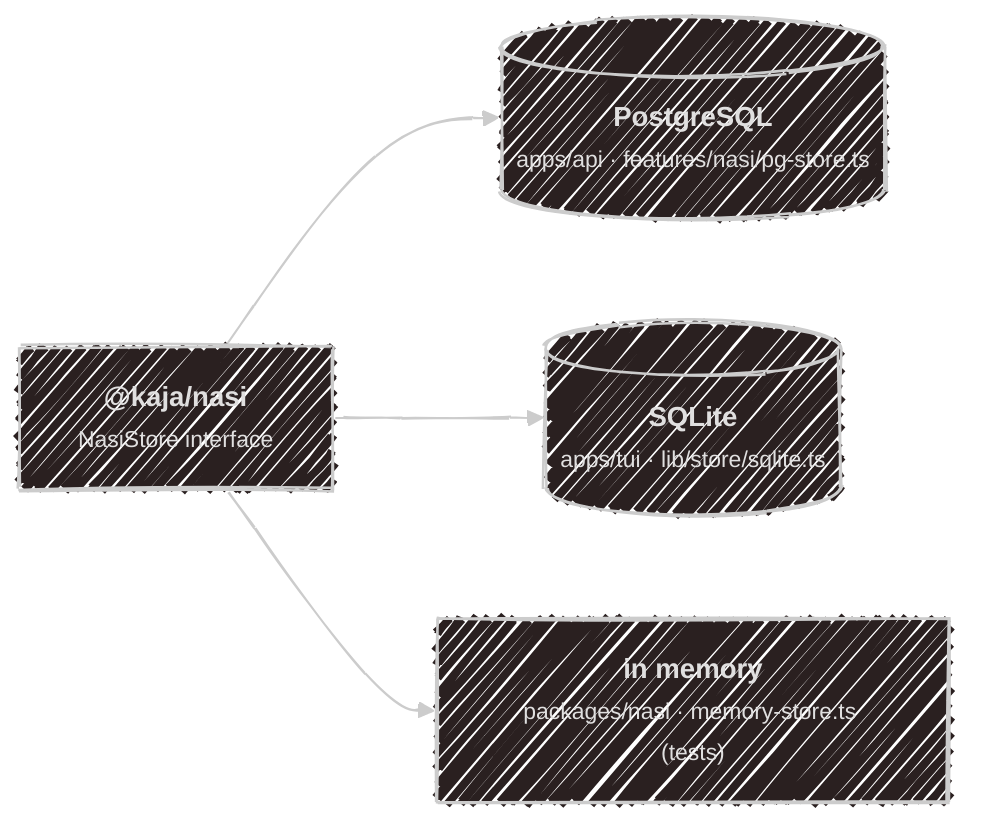
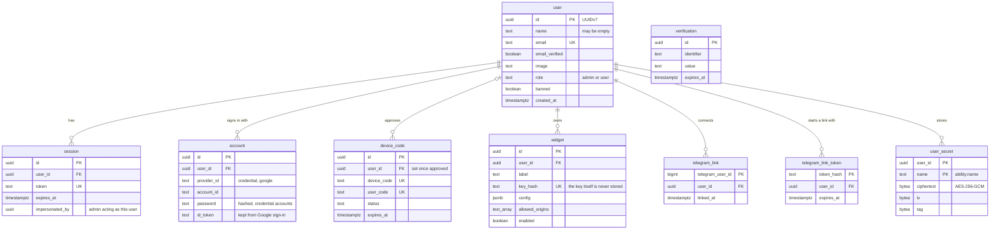
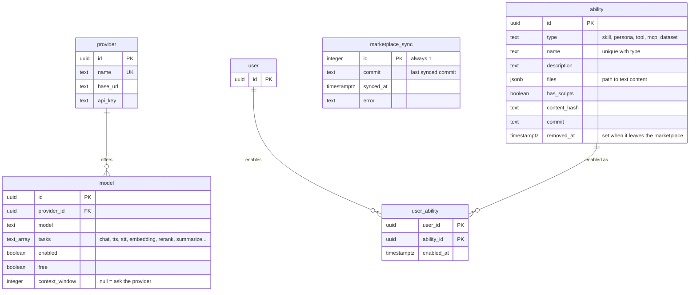
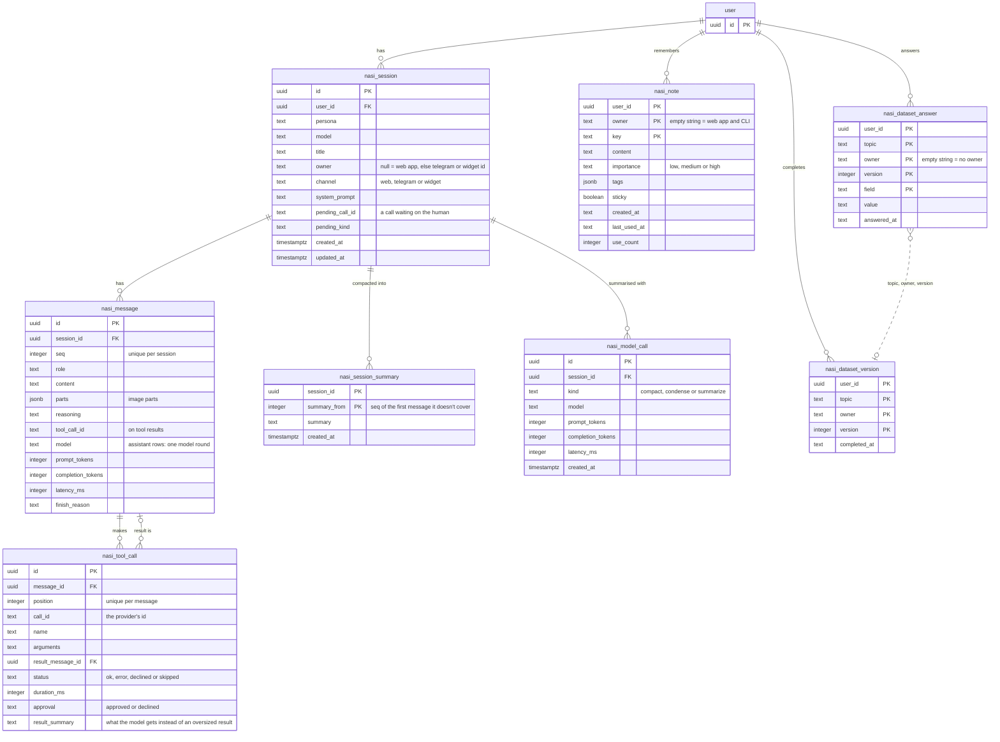

# Database

Kaja has two databases, and they are deliberately not the same size. The **cloud** keeps everything the
platform needs in **PostgreSQL**: accounts, server config, the ability catalog, widgets, Telegram links,
users' secrets, and the agent's own state. The **terminal** in [local mode](/modes) keeps only that last
part — one person's conversations, memory and dataset answers — in a single **SQLite** file. Everything
else a local install needs is a file: [`settings.toml`, `models.toml`, `mcp.toml`, `abilities.toml`](/configuration).

The agent state is the one place the two overlap, and that overlap is a contract: the
[agent brain](/development/nasi) talks to a `NasiStore` interface, and each host injects its own
implementation.

## How the schema is managed

**PostgreSQL** has plain SQL files in `apps/api/migrations/`, applied in lexicographic order:

| File | Creates |
| --- | --- |
| `2026-03-01-uuidv7.sql` | the `uuidv7()` function (via `pgcrypto`) |
| `2026-03-03-better-auth.sql` | `user`, `session`, `account`, `verification`, `device_code` |
| `2026-08-01-config.sql` | `provider`, `model` |
| `2026-08-31-widget.sql` | `widget` |
| `2026-09-07-nasi.sql` | `nasi_session`, `nasi_message`, `nasi_tool_call`, `nasi_session_summary`, `nasi_model_call`, `nasi_note`, `nasi_dataset_answer`, `nasi_dataset_version` |
| `2026-09-10-telegram-link.sql` | `telegram_link`, `telegram_link_token` |
| `2026-09-19-ability.sql` | `ability`, `user_ability`, `marketplace_sync` |
| `2026-09-19-user-secret.sql` | `user_secret` |

Every file only *creates* (`IF NOT EXISTS`), and the API's `migrate.ts` re-runs all of them on every
deploy, so they have to stay idempotent. The files run on the first boot of the compose volume; for an
existing volume use `scripts/db_migration.sh`.

**Until v1.0 there are no patch migrations.** There is no production data worth keeping, so a schema
change is edited into the file that creates the table, and existing databases are recreated: locally
`docker compose down -v`, in production see [Deployment](/development/deployment#recreating-the-database).

Conventions:

- **Primary keys** are UUIDv7 (time-ordered). Most tables default to `uuidv7()`; the `nasi_*` tables take the
  id from the app, which generates it before the insert.
- **Names** are `snake_case`, Better Auth's tables included: `auth.ts` maps each of its camelCase fields (`emailVerified` is `email_verified`, the `deviceCode` table is `device_code`).
- **Types**: `timestamptz` for times, `jsonb` for structured blobs, `text[]` for lists, `boolean` for flags.
- **Enums are `CHECK` constraints**, not Postgres enum types, so adding a value is a one-line change.
- **Everything that belongs to a person cascades** from `user`: deleting the account deletes its sessions,
  notes, keys, widgets and links.
- Row shapes stay private to the API's `services/`; they are mapped to the API types with private helpers.

**SQLite** has no migration files. `createSchema()` in `apps/tui/lib/store/sqlite.ts` runs every time the file
is opened: it creates missing tables, adds the one column older installs lack (`notes.owner`), and drops
the two earlier session layouts rather than converting them. It opens in WAL mode with foreign keys on.

## PostgreSQL

There are 20 tables in three groups.

### Accounts and access

Better Auth owns the first five tables; the rest hang off `user`. Only the columns that matter here are
shown — see the [migration](https://github.com/SubZtep/kaja/blob/main/apps/api/migrations/2026-03-03-better-auth.sql)
for the full list.

`verification` stands alone: Better Auth uses it for email and password-reset tokens and looks rows up by
`identifier`. `device_code` is the CLI's device login: the terminal polls it until a signed-in user approves
the code on the web.

`user_secret` holds the API keys people save for abilities. The value never leaves the server: it is
encrypted with `USER_SECRET_KEY`, and the user id and `name` are bound in as associated data, so a row
copied to another user or name fails to decrypt.

### Server config and abilities

The first two tables are what an admin manages at `/admin`; there is no user id, because they configure the
whole deployment. The ability tables are the cloud's copy of the marketplace.

- `ability` rows come from the repo's `marketplace/` folder, synced hourly and on demand (see [Marketplace internals](/development/marketplace)). A sync never
  deletes: an ability that leaves gets `removed_at`, so users' selections survive and come back if it returns.
- `user_ability` is a user's on/off switches. `marketplace_sync` is a single row that lets an unchanged
  branch skip the download.
- Personas and datasets are `ability` rows too (type `persona` and `dataset`), synced like skills. A user
  switches skills, tools, MCP servers and personas; datasets come with the personas that use them. There is
  no separate persona table.

### The cloud agent's state

This is the group that mirrors the SQLite file. Everything hangs off one `user`, so a person's cloud terminal chats,
Telegram bot and widget visitors are all partitioned by `user_id`, and by `owner` within it.

A session is **rows**, not a blob: one row per message and one per tool call. The assistant's messages
double as its steps, carrying the model, token counts, latency and finish reason of that round, which is
what the usage stats on the dashboard are computed from. Deleting a message never leaves a dangling result:
`result_message_id` is set to null instead.

The message log is append-only and never shortened. When a long conversation is
[compacted](/configuration/config#context), a `nasi_session_summary` row is added and the model is sent the
latest summary in place of the messages before `summary_from`; every earlier summary stays. A tool result too
big for the context keeps its full output in its message, and the condensed version the model gets goes in
`nasi_tool_call.result_summary`. Each request that wrote a summary (compacting, condensing, or the
`summarize` tool) is a `nasi_model_call` row, so the stats count its tokens too.

An image a message carries (a screenshot a tool returned, say) is not in the database: it goes to object
storage once per session, under `images/<userId>/<sessionId>/<hash>`, and the message's `parts` refer to it
as `kaja-image:<hash>`; loading the session puts the image back in place, and deleting it removes the images.

Datasets have no foreign key between answers and versions: answers are written field by field as the user
replies, and the `nasi_dataset_version` row appears only when the topic is complete.

## SQLite

The local file is the second half of the agent state, documented table by table on
[Local storage](/configuration/storage). It has nine tables: `notes`, `sessions`, `messages`, `tool_calls`,
`session_summaries`, `model_calls`, `session_events`, `dataset_answers` and
`dataset_versions`.

## Side by side

### Table mapping

| Concept | PostgreSQL | SQLite |
| --- | --- | --- |
| Conversation | `nasi_session` | `sessions` |
| Message (and step) | `nasi_message` | `messages` |
| Tool call | `nasi_tool_call` | `tool_calls` |
| Compaction summary | `nasi_session_summary` | `session_summaries` |
| Summarizer call | `nasi_model_call` | `model_calls` |
| Message image | object storage, `images/<userId>/<sessionId>/` | files, `images/<sessionId>/` |
| Memory note | `nasi_note` | `notes` |
| Dataset answer | `nasi_dataset_answer` | `dataset_answers` |
| Completed dataset | `nasi_dataset_version` | `dataset_versions` |
| What the terminal screen showed | not stored | `session_events` |
| Accounts, sessions, device login | Better Auth tables | none (the token lives in the OS keychain) |
| Providers and models | `provider`, `model` | `models.toml` |
| MCP servers | `ability` rows of type `mcp` | `mcp.toml` for your own, and the marketplace folder |
| Abilities | `ability`, `user_ability`, `marketplace_sync` | the `marketplace/` folder and `abilities.toml` |
| API keys | `user_secret` (encrypted) | `secrets.toml` |
| Widgets, Telegram links | `widget`, `telegram_link*` | none (local mode has no widgets; the bot's token is in `secrets.toml`) |

### How they differ

| | PostgreSQL | SQLite |
| --- | --- | --- |
| **Whose data** | many accounts; every row belongs to a `user_id` with `ON DELETE CASCADE` | one person; no user table, so `owner` is the only namespace |
| **Where** | a server, over a connection pool | one file, `memory.sqlite`, in the XDG data directory (overridable with `[memory] dbPath`) |
| **Concurrency** | MVCC; many API requests at once | WAL mode with a 5 s `busy_timeout`, so the terminal and the Telegram bot can share the file |
| **Ids** | `uuid`, app-generated UUIDv7 for `nasi_*` | `TEXT`, app-generated UUIDv7 |
| **Times** | `timestamptz`, always UTC instants | ISO-8601 `TEXT` in UTC (`…Z`) |
| **Structured data** | `jsonb`, `text[]` | JSON in `TEXT` |
| **Booleans** | `boolean` | `INTEGER` 0/1 |
| **Column names** | `snake_case` | `camelCase` |
| **Foreign keys** | always enforced | enforced only because `PRAGMA foreign_keys = ON` is set on each connection |
| **Schema changes** | SQL migration files, re-run on every deploy | `createSchema()` on every open; a missing column is added in place, older layouts are dropped, not converted |
| **Deleting your data** | delete the account and the cascade does it | delete the file |

### Differences that change behaviour

- **`session_events` is SQLite-only.** The terminal stores its rendered timeline so a resumed session looks
  the way it did. The cloud keeps no timeline: `NasiStore` passes `events` in, and the Postgres store ignores
  it and returns an empty list.
- **`channel` and stricter checks are Postgres-only.** `nasi_session.channel` (`web`, `telegram`, `widget`) is
  derived from the owner's prefix when the row is written, and `pending_kind` has a `CHECK`. SQLite stores
  `pendingKind` as free `TEXT`. Both back ends check `importance`, tool-call `status` and `approval`.
- **Notes and datasets partition the same way.** Both back ends key them by `owner`, with the empty string for
  "no owner" (so it can sit in a primary key): the web app, a Telegram user and each widget visitor keep their
  own notes and answers. The cloud adds `user_id` in front. A save replaces only that owner's set.

---

Next:

[Web](/development/web){: .btn .btn-green .fs-5 }
