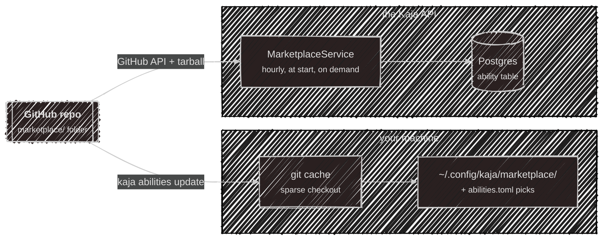
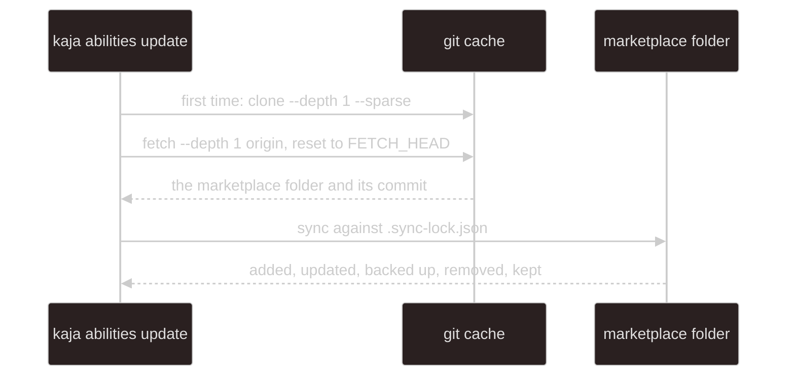
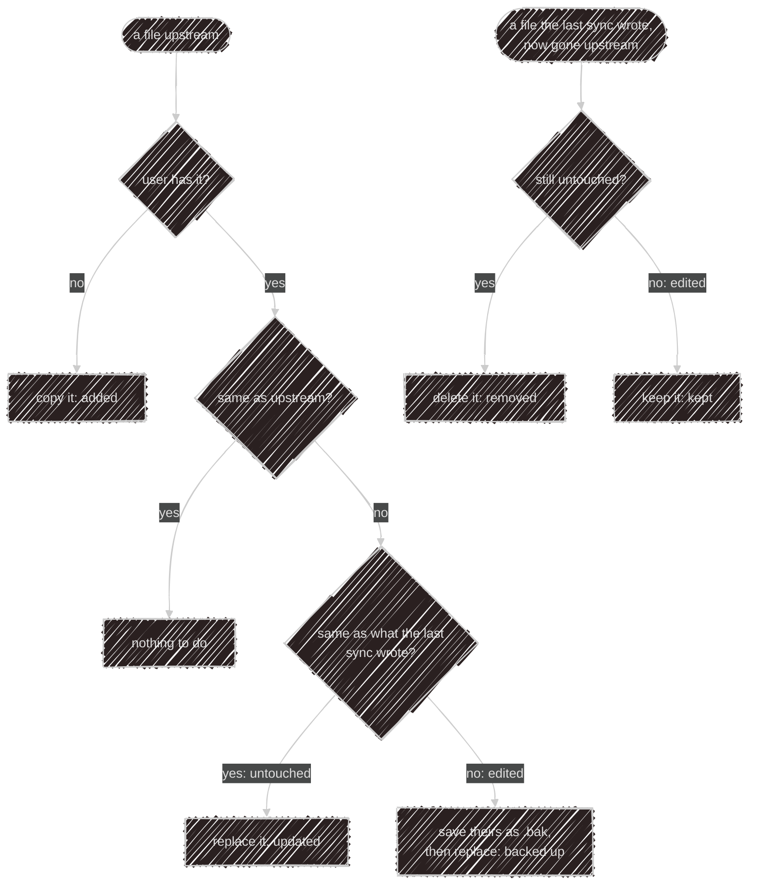
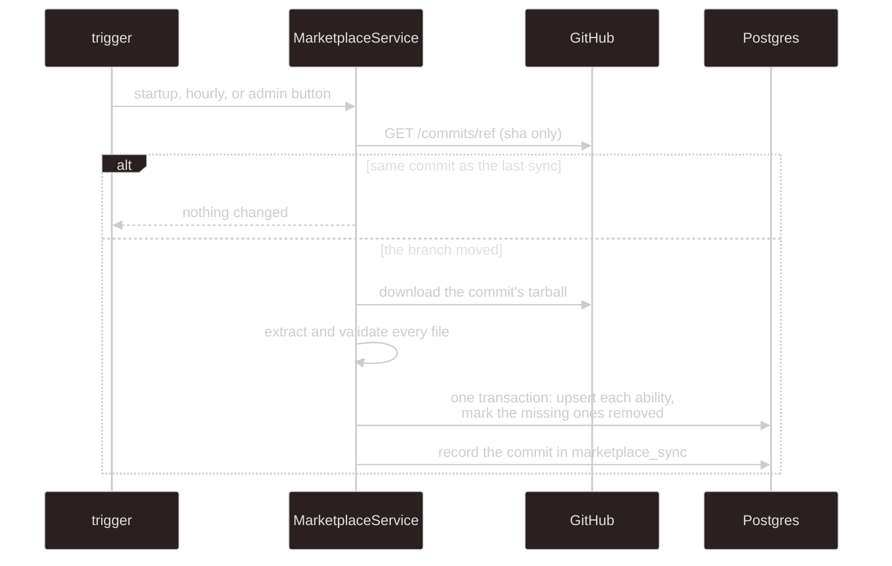

# Marketplace internals

The user-facing side is on [Abilities](/abilities). This page is how the two copies of the
`marketplace/` folder are kept.

There is no publishing flow and no registry service: the repo owner adds a file, and two consumers copy
the folder on their own schedule. The copies are separate and can be at different commits — the
terminal never talks to the API's copy, and the API never reads anyone's disk.

Each kind has one manifest format, checked by the schemas in
[`@kaja/schema/abilities`](/development/schema). Names are lowercase letters, digits and single
hyphens, up to 64 characters, and must match the folder (skills) or file name (everything else). A file
that fails validation is skipped with a warning by whoever reads it. Binary files, hidden files and
`.bak` backups are never served to the model.

## The terminal's copy

- Needs `git` 2.25+ (`clone --sparse`); the version is checked first, and `kaja doctor` shows it.
  Prompts are off, so a private or mistyped URL fails instead of waiting for a password, and every git
  call has a two-minute timeout. Changing `[source] url` re-clones.
- Each sync compares, per file, the upstream copy, the user's copy, and the hash the previous sync
  recorded in `.sync-lock.json`:

The sync keeps the executable bit on scripts and prunes folders it emptied. At startup the terminal
reads only what `abilities.toml` lists.

## The API's copy

- **Triggers.** Once at API start-up (in the background), every hour on the hour, and the admins'
  **Sync now** button. Only one sync runs at a time.
- **Cheap when idle.** The check is one unauthenticated GitHub API call, so the repo must be public. The
  tarball (capped at 50 MB) is only downloaded when the branch head moved.
- **Which repo.** `MARKETPLACE_REPO` (default `SubZtep/kaja`) and `MARKETPLACE_REF` (default `main`).
- **Failures are recorded** in the single `marketplace_sync` row, shown in the admin panel, and
  reported to Sentry. The previous catalog stays in place.
- **Nothing is deleted.** An ability that leaves the folder gets `removed_at`; users' selections survive
  and come back if it returns. `updated_at` only moves when the content hash — which covers just what
  the agent sees — changes.

An ability that can't run in the cloud is skipped at sync time, and one that stops qualifying is hidden
from the catalog: a skill with `scripts/`; an HTTP tool on a non-public host, or needing a key when the
server has no `USER_SECRET_KEY`; an MCP server that's `stdio`, has no `tools` allowlist, is on a
non-public host, or shares a name with an HTTP tool (a key belongs to one name); anything whose manifest
no longer parses.

## Loading

Whichever front door a turn comes in through, [`@kaja/nasi`](/development/nasi#abilities) does the
loading: it asks an `AbilityStore` — the folder on disk, or the Postgres copy — for the enabled
abilities, and turns them into tools, skills in the system prompt, and roster personas. The prompt's
skill and persona sections are rebuilt every turn, which is why a change applies from the next message.

| Front door | Where the choice is stored |
| --- | --- |
| terminal (local), local Telegram bot | `abilities.toml` and the `marketplace/` folder |
| terminal (cloud), cloud Telegram bot | the account's `user_ability` rows |
| widget | the key's `config.skills` |

---

Next:

[Deployment](/development/deployment){: .btn .btn-green .fs-5 }
