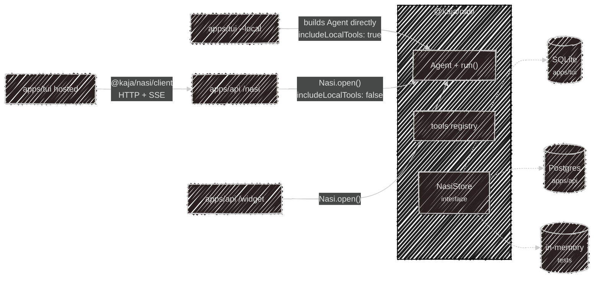
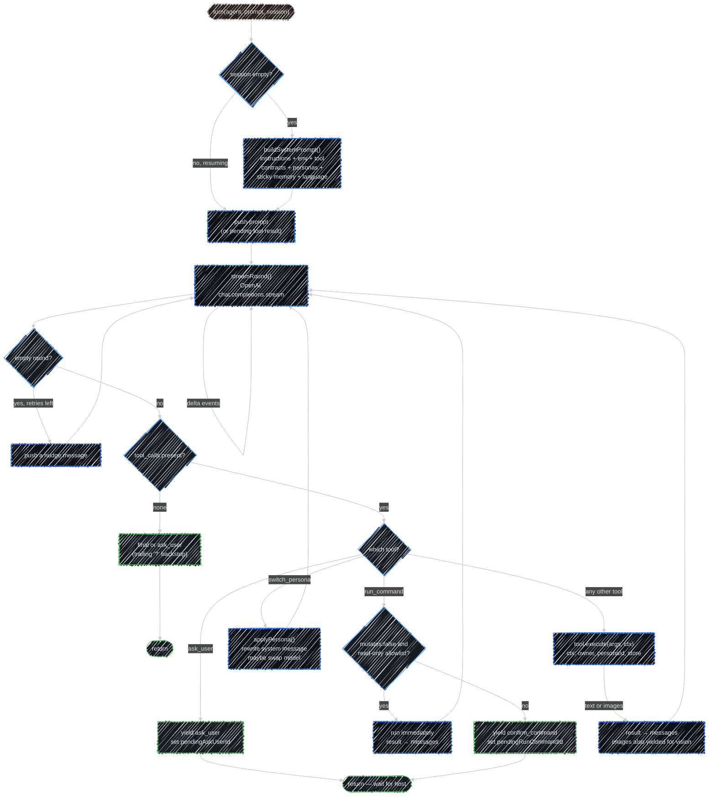

# @kaja/nasi

The agent brain: an OpenAI-compatible tool loop, a store interface, and the built-in tools. Every
front door in Kaja — terminal, Telegram, hosted chat, widget — runs *this* loop. What differs is
who hosts it and what it's allowed to touch.

The package has no Ink, no Hono, no Better Auth, no sqlite, and no pg. It reads no config files.
The **host** injects everything: a store, a model client, prompt context, and whether local tools
are on.

## Hosts



| Host | How it runs the loop | Store | Local tools |
| --- | --- | --- | :---: |
| CLI `--local` | builds an `Agent` and calls `run()` in-process | SQLite | ✓ |
| API `/nasi` | `Nasi.open()` scoped to the signed-in account | Postgres | ✗ |
| API `/widget` | `Nasi.open()` scoped to the key's owner, namespaced per visitor | Postgres | ✗ |
| CLI hosted | no loop at all — `@kaja/nasi/client` over HTTP | (server's) | ✗ |

## Two entry points

| Import | What you get |
| --- | --- |
| `@kaja/nasi` | `Nasi`, `Agent`, `run()`, the store interface, the tools. Pulls in the loop. |
| `@kaja/nasi/client` | `createNasiClient` only — the HTTP/SSE client. Must never import the loop. |

That split is what keeps the hosted CLI small: it ships the client, not the agent.

## Inputs and outputs

The API host and widget host don't touch `Agent`/`run()` directly — they go through `Nasi`, which
wraps loading a session, running one turn, and persisting it back.

```ts
const nasi = await Nasi.open({
  store,                 // NasiStore — Postgres for API/widget
  chat: { client, model }, // OpenAI-compatible client + default model id
  includeLocalTools: false,
  personas,               // this account's/persona's roster, or []
  promptContext,          // environment/askUser/location/language overrides
  owner,                   // null, or a namespaced widget-visitor id
  deps                     // extra tool deps, merged over `chat` — gates dep-conditional tools
})

const response = await nasi.turnBuffered({ session, message, includeThinking, language })
// or: for await (const event of nasi.turn({ ... })) { ... }
```

**In:** `NasiTurnInput` — `session` (a UUIDv7 to resume, omitted to start fresh), `message` (1–32,768
chars), and optional `includeThinking` / `language` / `personaId`.

**Out:** `NasiTurnResponse` — the same shape whether you awaited `turnBuffered()` or drained
`turn()`'s generator to its return value:

| Field | Meaning |
| --- | --- |
| `session` | the session id — pass it back on the next turn |
| `status` | `completed` / `needs_input` / `needs_approval` / `error` |
| `message` | the reply, or the pending question/command when not `completed` |
| `steps` | ordered `NasiStep[]` — reasoning, messages, tool calls, handoffs — for rendering a transcript |
| `thinking` | full reasoning text, only when `includeThinking` was set |
| `usage` | `promptTokens` and which `model` actually served the request |

`turn()` yields every `AgentEvent` (including token-level `delta`s) as the turn runs, then returns
that same `NasiTurnResponse` once persistence finishes — that's what lets the API stream SSE and
still hand back one consistent shape at the end.

## The loop

`run(agent, prompt, session, owner)` is an async generator. It yields events as they happen and
mutates the `Session` you hand it — persistence is the host's job.

| Event | When |
| --- | --- |
| `delta` | token chunks, on either the `reasoning` or `content` channel |
| `reasoning` / `message` | the complete text for one round |
| `tool_call` | the model invoked a tool |
| `tool_image` / `display_image` | an image to feed back as vision / to show in the UI only |
| `ask_user` | stop and wait — the next prompt becomes the tool result |
| `confirm_command` | stop and wait for shell approval |
| `persona_switch` | the persona (and maybe the model) changed mid-turn |
| `final` | the turn is done |
| `usage` | prompt tokens and the model that served the request |

Three tools are **intercepted** rather than executed normally: `ask_user`, `run_command`, and
`switch_persona`. They're how the loop hands control back to the host.

A trailing `?` on otherwise-final assistant text is also surfaced as `ask_user`, so a rhetorical
question doesn't stall an HTTP turn.

Inside one turn, `run()` loops rounds of "call the model → run any tool calls → call the model
again" until a round ends with no tool calls (→ `final`/`ask_user`) or a tool call needs a human
(→ `ask_user`/`confirm_command`, which sets `session.pendingAskUserId`/`pendingRunCommandId` and
returns). A round that comes back completely empty — no text, no tool call — is nudged and retried
up to 5 times before falling back to a fixed "I'm drawing a blank" message, so the app never has to
render a blank turn.



## Turn statuses

Over HTTP the same loop is buffered into one response:

| `status` | Meaning |
| --- | --- |
| `completed` | the turn finished; `message` is the reply |
| `needs_input` | `ask_user` is pending — send the answer as the next `message` |
| `needs_approval` | `run_command` is waiting — send the approval as the next `message` |
| `error` | the turn failed |

`session` comes back on every response; send it again to continue the conversation.

## System prompt

`buildSystemPrompt()` assembles the system message once, when a session's message list is still
empty — resuming a session reuses what's already there, except a persona switch mid-turn, which
rewrites it in place. It concatenates whichever of these blocks apply, in order:

1. the persona's `instructions` (or none, for the default agent)
2. `## Environment` — OS/home line, or the host's override (`PromptContext.environment`), plus a
   resolved location block when geolocation is available
3. `## Tool contract: ask_user` — only when that tool is in the registry; hosted hosts override the
   terminal-flavored default via `PromptContext.askUserInstruction`
4. `## Tool contract: run_command` — only when `includeLocalTools` exposed it
5. `## Tool contract: memory` — only when `remember_note` is in the registry
6. `## Personas` — the roster and switching rules, only with more than one persona and
   `switch_persona` available
7. `## Dataset collection` — only when the persona is bound to a dataset topic
8. sticky memory notes (from the store, or `PromptContext.loadStickyNotes`)
9. a reply-language instruction (`PromptContext.replyLanguageInstruction`)

Every block is conditional on what's actually wired up, so the prompt a hosted turn sees is
strictly a subset of what a local `--local` session sees.

## Store and ownership

`NasiStore` is a plain interface over sessions, memory notes, and dataset answers — nasi never
opens a database itself. Three implementations exist: SQLite (CLI), Postgres (API), and in-memory
(tests).

`owner` namespaces rows *inside* one store: `null` for a terminal session, a namespaced id for a
Telegram user or widget visitor. Resuming a session whose owner doesn't match raises
`NasiSessionNotFound` — that's what stops two widget visitors sharing one account from reading each
other's chats.

## Tool exposure

`createTools({ includeLocalTools })` decides the registry. The default is **off**: only an explicit
allowlist of hosted-safe built-ins is returned, so a newly added tool is never hosted-exposed by
accident. Turning it on adds file, shell, MCP, and plugin tools. See [Tools](/tools) for the
resulting list.

Some built-ins are gated on a **dep** as well as the allowlist — they only register when the host
supplies what they need: `web_search` needs `webSearchApiKey`, `generate_image` needs
`imageGeneration`, and hosted `fetch_url` needs `fetchProxy`. A local registry exposes `fetch_url`
unconditionally, since it fetches from the user's own machine; hosted egresses from the server, so
without a proxy the tool is left out rather than fetching directly. Failing closed is deliberate —
a proxied fetch that can't reach its proxy raises `ProxyUnavailableError` instead of retrying
direct, which would silently defeat the point of configuring one.

---

Next:

[Hosted API](/development/api){: .btn .btn-green .fs-5 }
