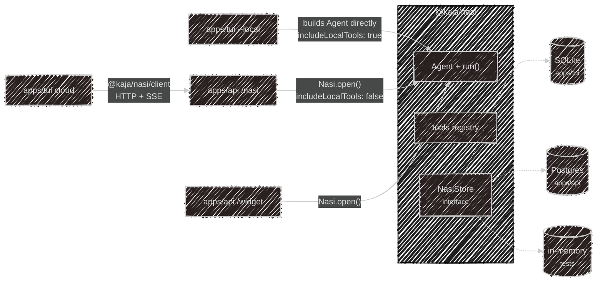
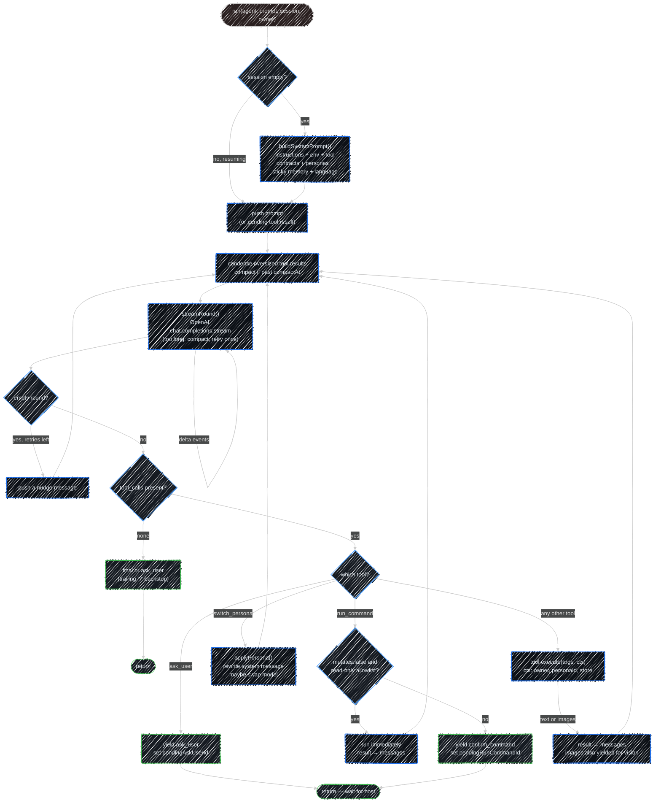

# @kaja/nasi

The agent brain: an OpenAI-compatible tool loop, a store interface, and the built-in tools. Every
front door in Kaja — terminal, Telegram, cloud chat, widget — runs *this* loop. What differs is
who hosts it and what it's allowed to touch.

The package has no Ink, no Hono, no Better Auth, no sqlite, and no pg. It reads no config files.
The **host** injects everything: a store, a model client, prompt context, and whether local tools
are on.

## Hosts



| Host | How it runs the loop | Store | Local tools |
| --- | --- | --- | :---: |
| CLI `--local` | builds an `Agent` and calls `run()` in-process | SQLite | ✓ |
| API `/nasi` | `Nasi.open()` scoped to the signed-in account | Postgres | ✗ |
| API `/widget` | `Nasi.open()` scoped to the key's owner, namespaced per visitor | Postgres | ✗ |
| CLI cloud | no loop at all — `@kaja/nasi/client` over HTTP | (server's) | ✗ |

## Two entry points

| Import | What you get |
| --- | --- |
| `@kaja/nasi` | `Nasi`, `Agent`, `run()`, the store interface, the tools. Pulls in the loop. |
| `@kaja/nasi/client` | `createNasiClient` only — the HTTP/SSE client. Must never import the loop. |

That split is what keeps the cloud CLI small: it ships the client, not the agent.

## Inputs and outputs

The API host and widget host don't touch `Agent`/`run()` directly — they go through `Nasi`, which
wraps loading a session, running one turn, and persisting it back.

```ts
const nasi = await Nasi.open({
  store,                 // NasiStore — Postgres for API/widget
  chat: { client, model }, // OpenAI-compatible client + default model id
  includeLocalTools: false,
  personas,               // this account's/persona's roster, or []
  promptContext,          // environment/askUser/language overrides
  owner,                   // null, or a namespaced widget-visitor id
  deps                     // extra tool deps, merged over `chat` — gates dep-conditional tools
})

const response = await nasi.turnBuffered({ session, message, includeThinking, language })
// or: for await (const event of nasi.turn({ ... })) { ... }
```

**In:** `NasiTurnInput` — `session` (a UUIDv7 to resume, omitted to start fresh), `message` (1–32,768
chars), and optional `includeThinking` / `language` / `personaId`.

**Out:** `NasiTurnResponse` — the same shape whether you awaited `turnBuffered()` or drained
`turn()`'s generator to its return value:

| Field | Meaning |
| --- | --- |
| `session` | the session id — pass it back on the next turn |
| `status` | `completed` / `needs_input` / `needs_approval` / `needs_client_tool` / `error` |
| `message` | the reply, or the pending question/command when not `completed` |
| `steps` | ordered `NasiStep[]` — reasoning, messages, tool calls, handoffs — for rendering a transcript |
| `thinking` | full reasoning text, only when `includeThinking` was set |
| `usage` | `promptTokens`, which `model` actually served the request, and its `contextWindow` when known |

`turn()` yields every `AgentEvent` (including token-level `delta`s) as the turn runs, then returns
that same `NasiTurnResponse` once persistence finishes — that's what lets the API stream SSE and
still hand back one consistent shape at the end.

## The loop

`run(agent, prompt, session, owner)` is an async generator. It yields events as they happen and
mutates the `Session` you hand it — persistence is the host's job.

| Event | When |
| --- | --- |
| `delta` | token chunks, on either the `reasoning` or `content` channel |
| `reasoning` / `message` | the complete text for one round |
| `tool_call` | the model invoked a tool |
| `tool_image` / `display_image` | an image to feed back as vision / to show in the UI only |
| `ask_user` | stop and wait — the next prompt becomes the tool result |
| `confirm_command` | stop and wait for shell approval |
| `confirm_tool` | stop and wait for approval of an HTTP tool or MCP call that changes something |
| `client_tool_call` | stop so the client can run `read_file` / `list_files` on the user's own disk (cloud only) |
| `persona_switch` | the persona (and maybe the model) changed mid-turn |
| `compacted` | the conversation was summarised before a round (`beforeTokens`, `afterTokens`, `dropped`); see [Long conversations](#long-conversations) |
| `condensed` | an oversized tool result was condensed before a round (`tool`, `beforeTokens`, `afterTokens`) |
| `final` | the turn is done |
| `usage` | prompt tokens, the model that served the request, and its context window |

Three tools are **intercepted** rather than executed normally: `ask_user`, `run_command`, and
`switch_persona`. They're how the loop hands control back to the host.

A trailing `?` on otherwise-final assistant text is also surfaced as `ask_user`, so a rhetorical
question doesn't stall an HTTP turn.

Inside one turn, `run()` loops rounds of "call the model → run any tool calls → call the model
again" until a round ends with no tool calls (→ `final`/`ask_user`) or a tool call needs a human
(→ `ask_user`/`confirm_command`, which sets `session.pendingAskUserId`/`pendingRunCommandId` and
returns). A round that comes back completely empty — no text, no tool call — is nudged and retried
up to 5 times before falling back to a fixed "I'm drawing a blank" message, so the app never has to
render a blank turn.



## Long conversations

Before every round, `run()` keeps the request inside the model's context window. `Session.messages` is
never shortened; only what the model is sent changes (`contextMessages()`).

- **The window** is `Agent.contextWindow`. A host can set it (the cloud does, per model row); otherwise
  `resolveContextWindow()` finds it from the agent's `models` entry: `context_window` from `models.toml`,
  else what the server reports (llama.cpp `/props`, Ollama `/api/ps` and `/api/show`, an OpenAI-compatible
  `/models` entry, Fireworks' model API, all asked at once), else 32,768. It is cached per server and model.
- **Oversized tool results** (over a quarter of the window) are condensed once by
  `condenseOversizedResults()`, told which call produced them and what the user asked. The model gets the
  condensed text (`Session.toolSummaries`, by call id); the tool message keeps the full output.
- **Compaction**: when a character-count estimate, scaled each round to what the provider actually counted,
  passes `Agent.compactAt` (0.8 by default) of the window, `compactSession()` summarises everything before a
  tail that fits a quarter of it. The tail starts at a user turn where it can, never at a tool result.
  `Session.summary` (`{ text, from }`) is then sent appended to the system prompt, followed by
  `messages[from..]`, and a `compacted` event is yielded. If the summary call fails, the older part is dropped
  with a note instead (`dropped: true`).
- **The summarizer** is `Agent.summarizer` (the `summarize` task's model), else the chat model. Text too big
  for its window is summarised in parts, then the parts together. Every request it makes (compacting,
  condensing, the `summarize` tool through `ToolContext.onModelCall`) goes into
  `Session.telemetry.modelCalls`, which the stores save as model call rows.
- **Too long anyway**: when the provider rejects the prompt as too long, the known window is lowered below
  it (for this process, `lowerContextWindow()`), the session is compacted, and the round is retried once.
  A second failure surfaces as `NasiModelUnavailable`, like any provider error.
- **On demand**: `compact(agent, session, focus?)` (and `Nasi.compact(sessionId, focus?)` for a stored
  session) summarises everything but the latest turn, with `focus` steering what the summary keeps. It
  backs `/compact` in the terminal, both Telegram bots and `POST /nasi/compact`.

Stores keep every summary and every condensed result beside the conversation; see
[Database](/development/database).

## Turn statuses

Over HTTP the same loop is buffered into one response:

| `status` | Meaning |
| --- | --- |
| `completed` | the turn finished; `message` is the reply |
| `needs_input` | `ask_user` is pending — send the answer as the next `message` |
| `needs_approval` | a tool call waits for the user's OK (a `confirm_tool` step): send `approval: "approve"` or `"decline"` next — the server runs the call it saved, never one the client describes; a plain `message` instead skips it |
| `needs_client_tool` | the model asked for `read_file` or `list_files`, which only the client can run on its own disk: the client runs the tool and sends its output as the next `message` |
| `error` | the turn failed |

`session` comes back on every response; send it again to continue the conversation.

## System prompt

`buildSystemPrompt()` assembles the system message when a session's message list is still empty.
Resuming a session reuses it, with two exceptions: the skill and persona sections are refreshed at the
start of every turn (so an ability change applies from the next message), and a persona switch rewrites
it in place. It concatenates whichever of these blocks apply, in order:

1. the persona's `instructions` (or none, for the default agent)
2. `## Environment` — OS/home line, or the host's override (`PromptContext.environment`)
3. `## Tool contract: ask_user` — only when that tool is in the registry; cloud hosts override the
   terminal-flavored default via `PromptContext.askUserInstruction`
4. `## Tool contract: run_command` — only when `includeLocalTools` exposed it
5. `## Tool contract: memory` — only when `remember_note` is in the registry
6. `## Personas` — the roster and switching rules, only with more than one persona and
   `switch_persona` available
7. `## Skills` — the enabled skills' names and descriptions, when `load_skill` is available
8. `## Dataset collection` — only when the persona is bound to a dataset topic
9. `## About the user` — the answers to a profile dataset, such as onboarding
10. sticky memory notes (from the store, or `PromptContext.loadStickyNotes`)
11. a reply-language instruction (`PromptContext.replyLanguageInstruction`)

Every block is conditional on what's actually wired up, so the prompt a cloud turn sees is
strictly a subset of what a local `--local` session sees.

## Store and ownership

`NasiStore` is a plain interface over sessions, memory notes, and dataset answers — nasi never
opens a database itself. Three implementations exist: SQLite (CLI), Postgres (API), and in-memory
(tests). A session is stored as rows (a message per row, a row per tool call) with each assistant step's
model, tokens and latency; the [Database](/development/database) page compares the two real schemas.

`owner` namespaces rows *inside* one store: `null` for a terminal session, a namespaced id for a
Telegram user or widget visitor. Resuming a session whose owner doesn't match raises
`NasiSessionNotFound` — that's what stops two widget visitors sharing one account from reading each
other's chats.

## Abilities

Skills, HTTP tools, MCP servers and personas come from an `AbilityStore` the host provides: the CLI reads the
`marketplace/` folder through `createFolderAbilityStore`, the API reads its Postgres copy of the catalog.
`loadAbilities` turns a store's enabled abilities into extra tools for the host to append, and one that
can't load (a broken manifest, a required key the user hasn't saved) is left out instead of stopping the
agent. See [Skills](/skills), [Tools](/tools) and [Personas](/personas) for what each kind does.

## Warnings

Nasi never logs. A recoverable problem (a skipped ability, a missing key, a failed MCP connection, an
unreachable fetch proxy) goes to a handler the host installs with `setWarnHandler`, which is silent until
set: the API prints them, and the terminal appends them to its opt-in log file, since Ink owns the screen.

## Tool exposure

`createTools({ includeLocalTools })` decides the registry. The default is **off**: only an explicit
allowlist of cloud-safe built-ins is returned, so a newly added tool is never cloud-exposed by
accident. Turning it on adds file, shell, MCP, and plugin tools. See [Tools](/tools) for the
resulting list.

Some built-ins are gated on a **dep** as well as the allowlist — they only register when the host
supplies what they need: `generate_image` needs `imageGeneration`, and cloud `fetch_url` needs
`fetchProxy`. A local registry exposes `fetch_url`
unconditionally, since it fetches from the user's own machine; cloud egresses from the server, so
without a proxy the tool is left out rather than fetching directly. Failing closed is deliberate —
a proxied fetch that can't reach its proxy raises `ProxyUnavailableError` instead of retrying
direct, which would silently defeat the point of configuring one.

`read_file` and `list_files` reach a cloud turn only as stubs that pause it with `client_tool_call`,
for the terminal to run on the user's machine. `clientTools: false` (on `createTools` and
`Nasi.open`) leaves them out for hosts with no such client: the API's widget and Telegram turns.

---

Next:

[Cloud API](/development/api){: .btn .btn-green .fs-5 }
