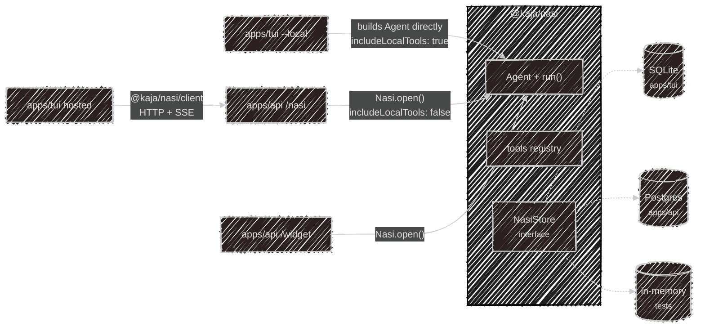

# @kaja/nasi

The agent brain: an OpenAI-compatible tool loop, a store interface, and the built-in tools. Every
front door in Kaja — terminal, Telegram, hosted chat, widget — runs *this* loop. What differs is
who hosts it and what it's allowed to touch.

The package has no Ink, no Hono, no Better Auth, no sqlite, and no pg. It reads no config files.
The **host** injects everything: a store, a model client, prompt context, and whether local tools
are on.

## Hosts

| Host | How it runs the loop | Store | Local tools |
| --- | --- | --- | :---: |
| CLI `--local` | builds an `Agent` and calls `run()` in-process | SQLite | ✓ |
| API `/nasi` | `Nasi.open()` scoped to the signed-in account | Postgres | ✗ |
| API `/widget` | `Nasi.open()` scoped to the key's owner, namespaced per visitor | Postgres | ✗ |
| CLI hosted | no loop at all — `@kaja/nasi/client` over HTTP | (server's) | ✗ |

## Two entry points

| Import | What you get |
| --- | --- |
| `@kaja/nasi` | `Nasi`, `Agent`, `run()`, the store interface, the tools. Pulls in the loop. |
| `@kaja/nasi/client` | `createNasiClient` only — the HTTP/SSE client. Must never import the loop. |

That split is what keeps the hosted CLI small: it ships the client, not the agent.

## The loop

`run(agent, prompt, session, owner)` is an async generator. It yields events as they happen and
mutates the `Session` you hand it — persistence is the host's job.

| Event | When |
| --- | --- |
| `delta` | token chunks, on either the `reasoning` or `content` channel |
| `reasoning` / `message` | the complete text for one round |
| `tool_call` | the model invoked a tool |
| `tool_image` / `display_image` | an image to feed back as vision / to show in the UI only |
| `ask_user` | stop and wait — the next prompt becomes the tool result |
| `confirm_command` | stop and wait for shell approval |
| `persona_switch` | the persona (and maybe the model) changed mid-turn |
| `final` | the turn is done |
| `usage` | prompt tokens and the model that served the request |

Three tools are **intercepted** rather than executed normally: `ask_user`, `run_command`, and
`switch_persona`. They're how the loop hands control back to the host.

A trailing `?` on otherwise-final assistant text is also surfaced as `ask_user`, so a rhetorical
question doesn't stall an HTTP turn.

## Turn statuses

Over HTTP the same loop is buffered into one response:

| `status` | Meaning |
| --- | --- |
| `completed` | the turn finished; `message` is the reply |
| `needs_input` | `ask_user` is pending — send the answer as the next `message` |
| `needs_approval` | `run_command` is waiting — send the approval as the next `message` |
| `error` | the turn failed |

`session` comes back on every response; send it again to continue the conversation.

## Store and ownership

`NasiStore` is a plain interface over sessions, memory notes, and dataset answers — nasi never
opens a database itself. Three implementations exist: SQLite (CLI), Postgres (API), and in-memory
(tests).

`owner` namespaces rows *inside* one store: `null` for a terminal session, a namespaced id for a
Telegram user or widget visitor. Resuming a session whose owner doesn't match raises
`NasiSessionNotFound` — that's what stops two widget visitors sharing one account from reading each
other's chats.

## Tool exposure

`createTools({ includeLocalTools })` decides the registry. The default is **off**: only an explicit
allowlist of hosted-safe built-ins is returned, so a newly added tool is never hosted-exposed by
accident. Turning it on adds file, shell, MCP, and plugin tools. See [Tools](/tools) for the
resulting list.

---

Next:

[Hosted API](/development/api){: .btn .btn-green .fs-5 }
