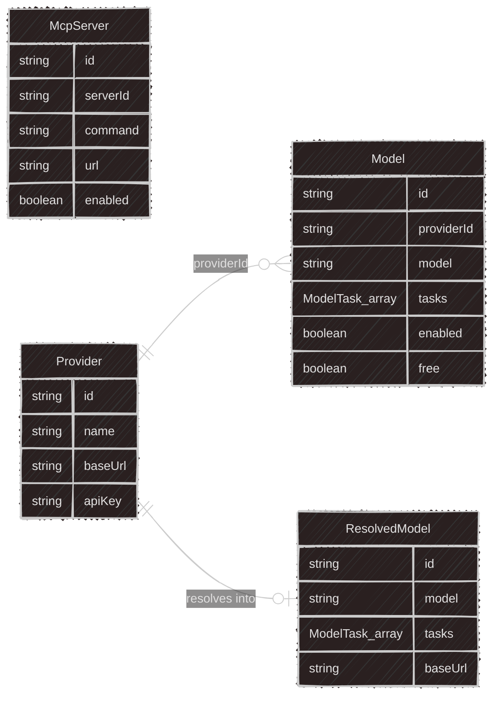
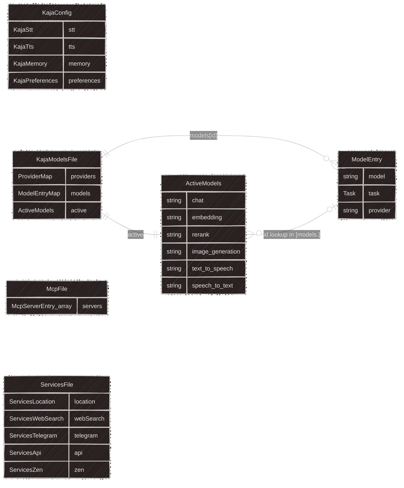
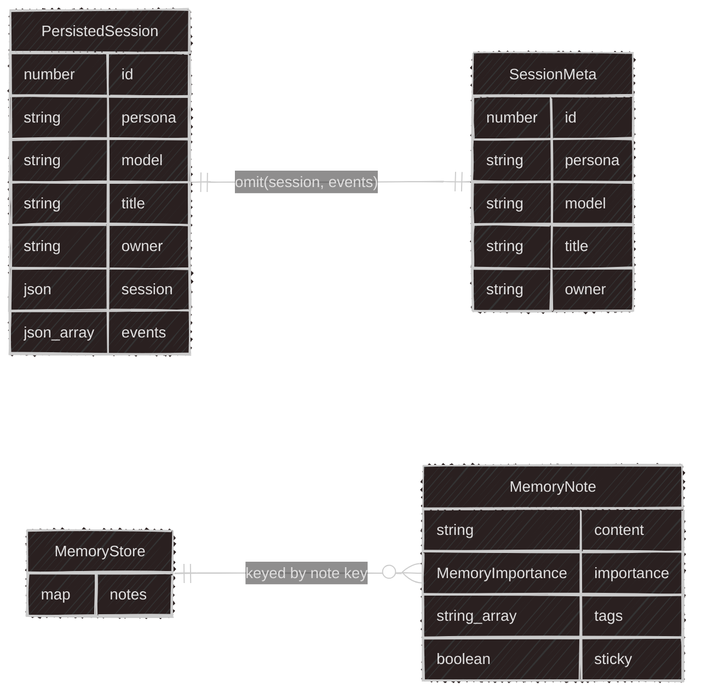

`@kaja/schema` is split into four role-based subpaths — `api`, `config`, `store`, `cli` — each its own import (no bare `@kaja/schema` import). See `packages/schema/AGENTS.md` for conventions.

## `@kaja/schema/api`

Shared by `apps/api`, `apps/web`.

## `@kaja/schema/config`

CLI on-disk files the user hand-edits (`apps/cli`).

## `@kaja/schema/cli`

Remaining CLI domain concepts (`apps/cli`).

## `@kaja/schema/store`

CLI SQLite-backed runtime state (`apps/cli`).

## Cross-subpath references

These aren't type imports (each subpath stays decoupled per `packages/schema/AGENTS.md`) — just IDs/strings that happen to reference a concept in another subpath at runtime:

- `config`'s `KajaPreferences.persona` → `cli`'s `Persona.id`
- `cli`'s `Persona.models.<task>` (all six tasks) → `config`'s own `CliResolvedModel.id` (soft fallback: unmatched id falls through to models.toml's `[active].<task>`, resolved per-task via `resolveActiveModel`)
- `store`'s `PersistedSession.persona` → `cli`'s `Persona.id`
- `store`'s `PersistedSession.model` → `api`'s `Model.id` (or a free-tier id)

## Subpaths

| Subpath | Contents | Consumers |
|---|---|---|
| `@kaja/schema/api` | `McpServer`, `Provider`/`Model`, auth payloads | `apps/api`, `apps/web` |
| `@kaja/schema/config` | `KajaConfig` (settings.toml), `KajaModelsFile` (models.toml), `McpFile` (mcp.toml), `ServicesFile` (services.toml) | `apps/cli` |
| `@kaja/schema/store` | `PersistedSession`/`SessionMeta`, `MemoryNote`/`MemoryStore` (SQLite-backed) | `apps/cli` |
| `@kaja/schema/cli` | `Persona`, `SamplingParams`, `Dataset`/`DatasetField` | `apps/cli` |
