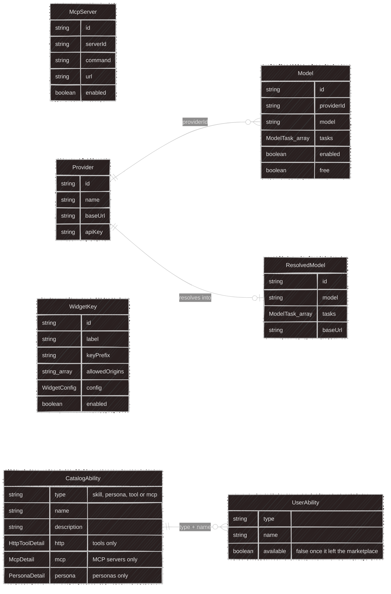
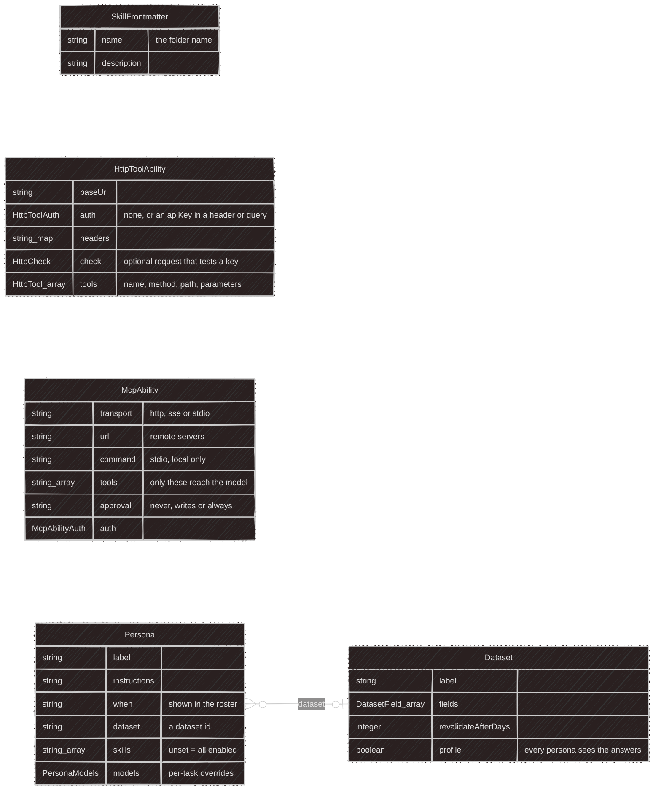
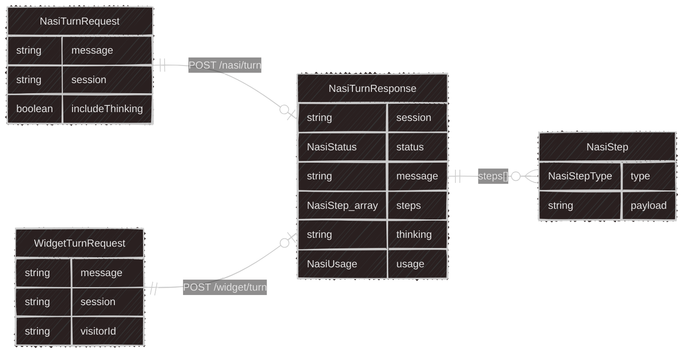
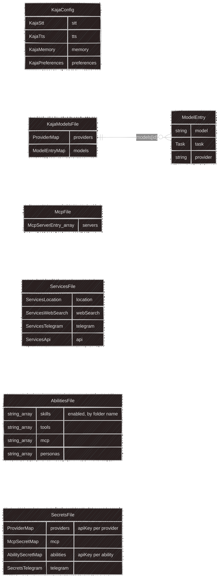
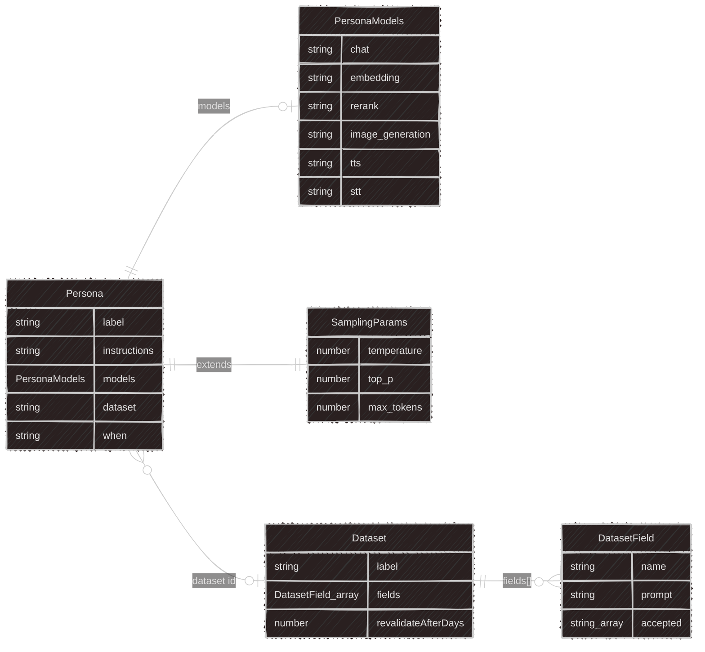

# @kaja/schema

Every Zod schema in the project lives here, split into role-based subpaths that are each their own
import — there is no bare `@kaja/schema` import, and no app keeps local schema files.

| Subpath | Contents | Consumers |
|---|---|---|
| `@kaja/schema/api` | REST contracts: `McpServer`, `Provider`/`Model`, `WidgetKey`, the ability catalog and users' keys, usage stats, the Telegram link, auth payloads | `apps/api`, `apps/web` |
| `@kaja/schema/nasi` | cloud turn request/response, widget turn | `apps/api`, `apps/tui`, `packages/nasi` |
| `@kaja/schema/abilities` | marketplace content: skill frontmatter, HTTP tool, MCP server, persona and dataset manifests | `apps/api`, `apps/tui`, `packages/nasi` |
| `@kaja/schema/config` | the CLI's hand-edited TOML files (settings, models, mcp, services, secrets, abilities) | `apps/tui` |
| `@kaja/schema/store` | SQLite/Postgres-backed runtime state | `apps/tui`, `packages/nasi` |
| `@kaja/schema/cli` | remaining CLI domain concepts: datasets, plus a re-export of the persona schema | `apps/tui` |
| `@kaja/schema/env` | env-var schemas — source of truth for every `.env.example` | build scripts |
| `@kaja/schema/tombi` | JSON Schema generation for the TOML config files | build scripts |

The last two are generators' input, not runtime imports: `bun generate:env`,
`bun generate:env-types`, and `bun generate:schemas` read them. See `packages/schema/AGENTS.md` for
naming conventions.

Dates are `z.coerce.date()` throughout, so JSON round-trips cleanly.

## `@kaja/schema/api`

Shared by `apps/api`, `apps/web`.

The same subpath also holds the key routes' payloads (`saveAbilityKeyRequestSchema` and its check result), the
marketplace sync status, the usage-stats response, the Telegram link response and the config export bundle.

## `@kaja/schema/abilities`

What a marketplace folder contains, read by whichever host loads it: the CLI from `marketplace/` on disk, the
API when it syncs the folder into Postgres. Each kind of ability has one manifest schema.

## `@kaja/schema/nasi`

The HTTP turn contract, shared by the API, the cloud CLI client, and the widget.

See [Agent brain](/development/nasi) for what the statuses and step types mean.

## `@kaja/schema/config`

CLI on-disk files the user hand-edits (`apps/tui`).

## `@kaja/schema/cli`

Remaining CLI domain concepts (`apps/tui`).

## `@kaja/schema/store`

CLI SQLite-backed runtime state (`apps/tui`).

## Cross-subpath references

These aren't type imports (each subpath stays decoupled per `packages/schema/AGENTS.md`) — just IDs/strings that happen to reference a concept in another subpath at runtime:

- `config`'s `KajaPreferences.persona` → `cli`'s `Persona.id`
- `cli`'s `Persona.models.<task>` (all six tasks) → `config`'s own `CliResolvedModel.id` (soft fallback: unmatched id falls through to models.toml's `[models.<task>]` entry, resolved per-task via `resolveActiveModel`)
- `store`'s `PersistedSession.persona` → `cli`'s `Persona.id`
- `store`'s `PersistedSession.model` → `api`'s `Model.id`

## TOML schemas

`bun generate:schemas` turns the `config`, `abilities` and `cli` schemas into the JSON Schemas under
[`docs/config/schemas`](https://github.com/SubZtep/kaja/tree/main/docs/config/schemas), which is
what gives editors completion and validation for `settings.toml`, `models.toml`, `mcp.toml`,
`services.toml`, `secrets.toml`, `abilities.toml`, and the marketplace manifests (personas, datasets, HTTP
tools and MCP abilities). The pre-commit hook regenerates them whenever those
schemas change — never edit the JSON by hand.

---

Next:

[Deployment](/development/deployment){: .btn .btn-green .fs-5 }
