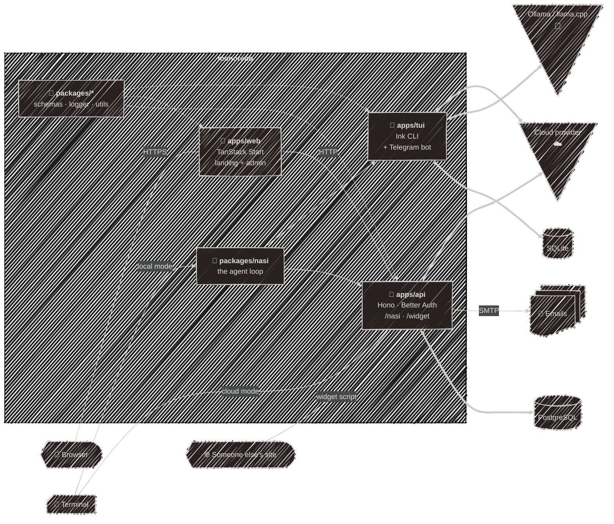

# Vision

Where the pieces sit, and why the shape is what it is.

## The three ideas

**One brain, many hosts.** The agent loop lives in `packages/nasi` and knows nothing about
terminals, HTTP, or databases. Everything that wants an answer — the CLI, the API, the widget —
constructs it with a store and a model client and drives the same loop. Adding a fourth front door
means writing a host, not another agent.

**Offline-first is a real option, not a marketing line.** In [local mode](/modes) there is no
account, no server, and no telemetry: config is plain TOML you can read, state is one SQLite file
you can delete, and pointed at Ollama or llama.cpp it needs no internet connection at all.

**The cloud path is the same product, minus your machine.** Cloud mode exists so someone can try
Kaja without an API key, not as a different app. Same loop, same tools minus the ones that would
reach into a server's filesystem, same personas and memory — just running somewhere else, against
an account.

## Deliberate non-goals

- **No mobile app.** Terminal, Telegram, and the browser widget cover the ground.
- **No ORM.** Raw parameterized SQL and hand-written row mappers; the schema is small enough that
  the abstraction would cost more than it saves.
- **No plugin marketplace.** Tools are a `.ts` file you drop in a directory, and MCP already
  standardizes the rest.

---

[Back to the start](/){: .btn .btn-green .fs-5 }
