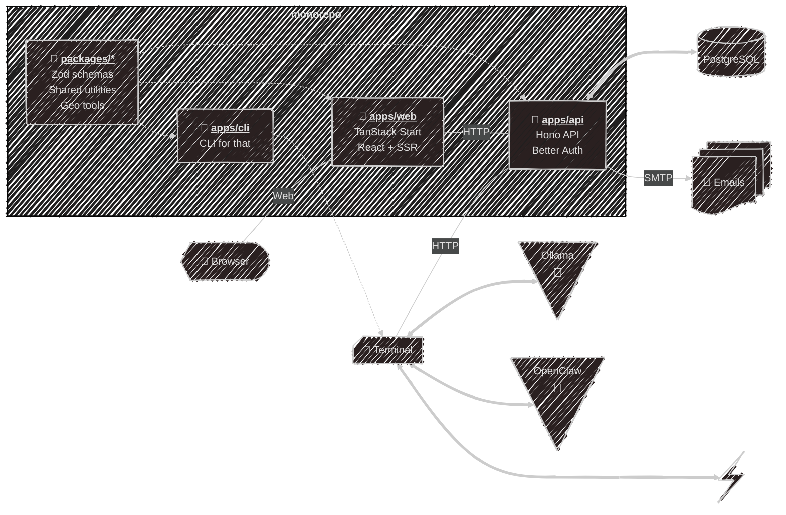

```mermaid
---
config:
  look: handDrawn
  theme: neo-dark
---
flowchart LR
  U@{ shape: curv-trap, label: "👤 Browser" }
  UW@{ shape: notch-rect, label: "👤 Terminal" }
  L@{ shape: manual-file, label: "Ollama<br><big>🦙</big>" }
  O@{ shape: manual-file, label: "OpenClaw<br><big>🦞</big>" }
  B@{ shape: bolt }

  D[(PostgreSQL)]
  E@{ shape: docs, label: "👤 Emails"}

  subgraph "`**monorepo**`"
    A["📁 <strong><u>apps/api</u></strong><br/>Hono API<br/>Better Auth"]
    W["📁 <strong><u>apps/web</u></strong><br/>TanStack Start<br/>React + SSR"]
    P["📁 <strong><u>packages/*</u></strong><br/>Zod schemas<br/>Shared utilities<br>Geo tools"]
    WW["📁 <strong><u>apps/cli</u></strong><br/>CLI for that"]
  end

  P -.-> A
  P -.-> W
  P -.-> WW

  U -- Web --- W
  UW -- HTTP --- A
  WW -.-> UW
  UW <==> L
  UW <==> O
  UW <===> B

  W -- HTTP --- A
  A <==> D
  A -- SMTP --> E

```
