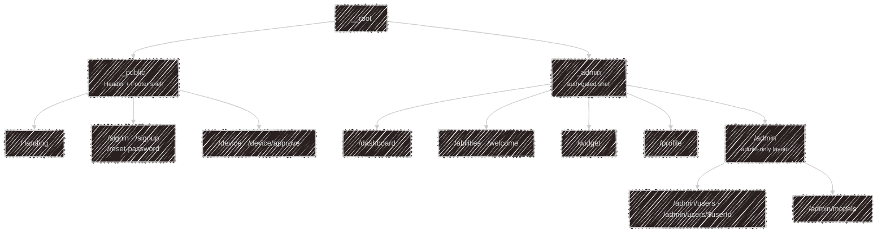

# apps/web

TanStack Start on Vite — one app serving two very different route trees, kept deliberately
separate.

## Public

The landing page at `/` is a set of sections — hero, why-kaja, personas, configuration, memory and
datasets, install instructions — plus a live **barkochba game** driven by the same
[widget](/widget) turn endpoint a third-party site would use. It talks to the API by plain fetch
rather than importing the widget workspace, precisely so it exercises the public contract.

`/device` and `/device/approve` are where the CLI's device login lands: sign in, confirm the code
the terminal printed, done.

## Signed in

Everything behind `_admin` (the auth-gated shell, despite the name) requires a signed-in, non-banned user.

The top menu is a static list, not something each page assembles: visitors see Sign In, Sign Up and Docs;
signed-in users see Dashboard, Profile, Abilities and Widget; admins also get one **Admin** item. Every
admin-only page sits under `/admin`, whose layout has its own tab bar and requires the Better Auth `admin`
role, sending anyone else to the dashboard. The menu hides the item and the layout enforces it.

| Route | What it is |
| --- | --- |
| `/dashboard` | a welcome, the Telegram connect card, and your [usage stats](/development/api#usage-stats--stats) |
| `/abilities` | turn skills, HTTP tools and MCP servers on and off in one list, then personas in a section of their own; admins also get the marketplace sync panel |
| `/welcome` | the same list without personas, shown right after sign-up |
| `/widget` | [widget keys](/widget#getting-a-key): create, edit, disable, delete |
| `/profile` | your own account: name and avatar, email, password |
| `/admin/users`, `/admin/users/$userId` | accounts, roles, bans |
| `/admin/models` | providers and their models, per task |

## Stack notes

- **Data**: React Query, with the API token pulled from the Better Auth session
- **Auth**: the Better Auth client lives in `hooks/auth-client.ts`; cookies are prefixed `kaja`
- **Forms**: TanStack Form
- **Styling**: Tailwind v4, Base UI React primitives, lucide icons
- **i18n**: Paraglide, generated into `src/paraglide/`; every string exists in `en-GB`, `hu-HU` and `nan-TW`
- **Errors**: failures worth knowing about go to Sentry; user-facing ones already show a toast
- `src/routeTree.gen.ts` is generated by the router plugin — don't hand-edit it; the pre-commit
  hook regenerates it whenever route files change

There are no automated UI tests yet.

---

Next:

[Schema](/development/schema){: .btn .btn-green .fs-5 }
