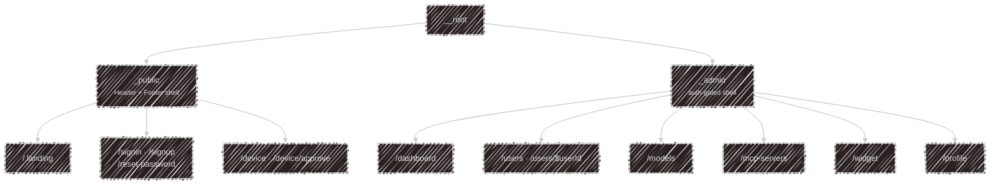

# apps/web

TanStack Start on Vite — one app serving two very different route trees, kept deliberately
separate.

## Public

The landing page at `/` is a set of sections — hero, why-kaja, personas, configuration, memory and
datasets, install instructions — plus a live **barkochba game** driven by the same
[widget](/widget) turn endpoint a third-party site would use. It talks to the API by plain fetch
rather than importing the widget workspace, precisely so it exercises the public contract.

`/device` and `/device/approve` are where the CLI's device login lands: sign in, confirm the code
the terminal printed, done.

## Admin

Everything behind `_admin` requires a signed-in, non-banned user; the config pages additionally
require the Better Auth `admin` role.

| Route | What you manage |
| --- | --- |
| `/dashboard` | overview |
| `/users`, `/users/$userId` | accounts, roles, bans |
| `/models` | providers and their models, per task |
| `/mcp-servers` | MCP servers offered to hosted chat |
| `/widget` | [widget keys](/widget#getting-a-key) — create, disable, delete |
| `/profile` | your own account |

## Stack notes

- **Data**: React Query, with the API token pulled from the Better Auth session
- **Auth**: the Better Auth client lives in `hooks/auth-client.ts`; cookies are prefixed `kaja`
- **Forms**: TanStack Form
- **Styling**: Tailwind v4, Base UI React primitives, lucide icons
- **i18n**: Paraglide, generated into `src/paraglide/`
- `src/routeTree.gen.ts` is generated by the router plugin — don't hand-edit it; the pre-commit
  hook regenerates it whenever route files change

There are no automated UI tests yet.

---

Next:

[Schema](/development/schema){: .btn .btn-green .fs-5 }
