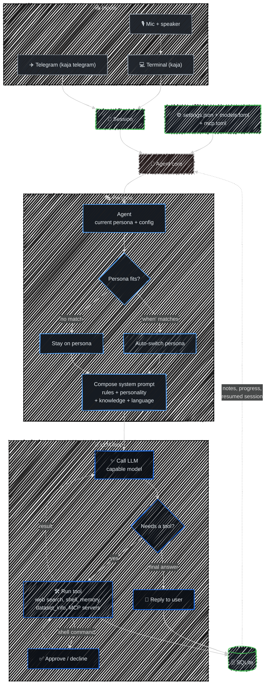

# Flow

One agent core, two front doors. The terminal and Telegram both drive the same persona, tools,
and model config.

```mermaid
---
config:
  look: handDrawn
  theme: neo-dark
---
flowchart TD
    subgraph Inputs["📥 Inputs"]
        Term["💻 Terminal (kaja)"]
        Tele["✈️ Telegram (kaja telegram)"]
        Voice["🎙️ Mic + speaker"]
    end
    Voice -.-> Term
    Term --> Session
    Tele --> Session
    Config["⚙️ settings.json + models.toml\n+ mcp.toml"] --> Core

    Session["🔗 Session"] --> Core
    Core["🧠 Agent core"] --> Agent

    subgraph Persona["🎭 Persona"]
        Agent["Agent\ncurrent persona + config"] --> Route{"Persona fits?"}
        Route -->|"'when' matches"| Switch["Auto-switch persona"]
        Route -->|"no match"| Stay["Stay on persona"]
        Switch --> Prompt
        Stay --> Prompt
        Prompt["Compose system prompt\nrules + personality\n+ knowledge + language"]
    end

    Prompt --> CallLLM

    subgraph LLMLoop["🔁 LLM loop"]
        CallLLM["✨ Call LLM\ncapable model"] --> Decide{"Needs a tool?"}
        Decide -->|yes| RunTool["🛠️ Run tool\nweb search, shell, memory,\ndataset_info, MCP servers"]
        RunTool -->|"shell command"| Confirm["✅ Approve / decline"]
        Confirm -.-> RunTool
        RunTool -.->|"result"| CallLLM
        Decide -->|"final answer"| Reply["💬 Reply to user"]
    end

    Reply --> DB
    RunTool --> DB
    DB[("🗄️ SQLite")]
    DB -.->|"notes, progress,\nresumed session"| Core

    classDef inputs fill:#21262d,stroke:#8b949e,color:#e6edf3
    classDef persona fill:#161b22,stroke:#58a6ff,color:#e6edf3
    classDef loop fill:#0d1117,stroke:#1f6feb,color:#e6edf3
    classDef store fill:#161b22,stroke:#3fb950,color:#e6edf3
    class Term,Tele,Voice inputs
    class Agent,Route,Switch,Stay,Prompt persona
    class CallLLM,Decide,RunTool,Confirm,Reply loop
    class DB,Config,Session store
```
