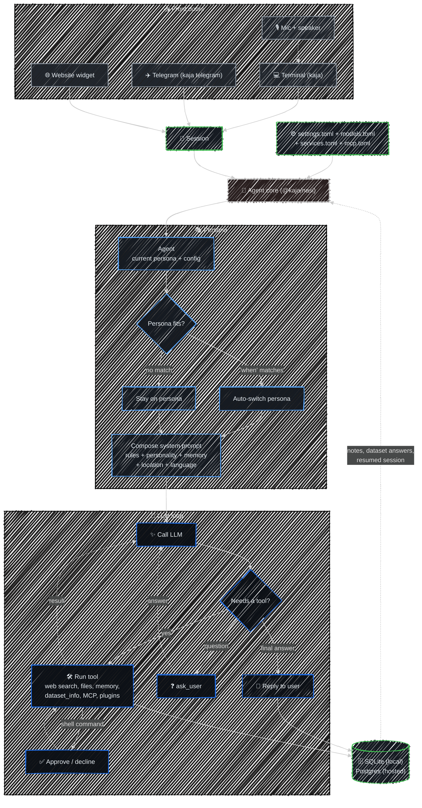

# Flow

One agent core, several front doors. Terminal, Telegram, and the website widget all drive the same
loop, personas, and tools — what differs is where the loop runs and which tools it's allowed.

## Where the loop runs

| Front door | Loop runs | Store | Local tools |
|---|---|---|---|
| `kaja --local` | your machine | SQLite | ✓ shell, files, MCP, plugins |
| `kaja` (hosted) | the API | Postgres | ✗ |
| `kaja telegram` | your machine | SQLite | ✓ |
| Website [widget](/widget) | the API | Postgres | ✗ |

## Handoffs

Two tools stop the loop and hand control back to whoever is driving:

- **`ask_user`** — the agent needs a clarification. Your next message becomes the tool result, not
  a new turn.
- **`run_command`** — the agent wants to run a shell command. It waits for approval; in the
  terminal that's the `/` picker, on Telegram an inline keyboard. Local mode only.

A third, **`switch_persona`**, is intercepted mid-loop and swaps the persona (and its pinned model)
without stopping.

---

Next:

[Personas](/personas){: .btn .btn-green .fs-5 }
