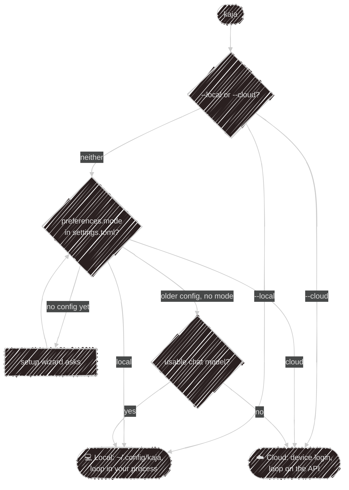
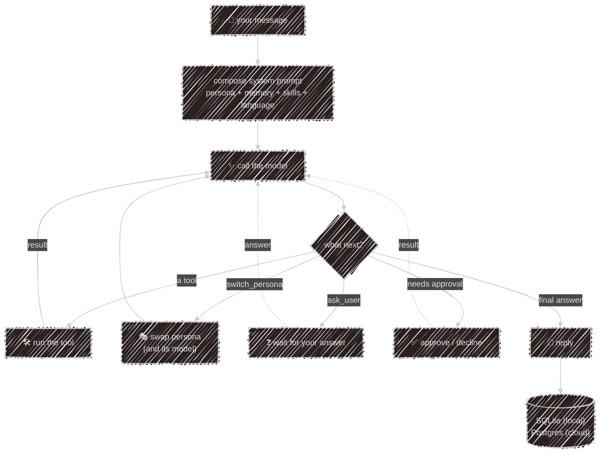

# Cloud or local

Kaja is one agent with several front doors — the terminal, Telegram and a website widget.
The difference between the two modes is *where the agent loop runs*, and so which tools it may use.

| Front door | Loop runs | Store | Your files, shell, own MCP servers and plugins |
|---|---|---|---|
| `kaja`, local mode | your machine | SQLite | ✓ |
| `kaja telegram` | your machine | SQLite | ✓ |
| `kaja`, cloud mode | the API | Postgres | ✗ (files are [read locally](#cloud-mode)) |
| cloud [Telegram bot](/using/telegram#cloud-bot) | the API | Postgres | ✗ |
| Website [widget](/using/widget) | the API | Postgres | ✗ |

## Which mode a launch uses



The [setup wizard](/getting-started/wizard) writes `preferences.mode`, so the choice sticks even before a provider
works: picking local and then "Skip — I'll set up models.toml myself" still starts in local mode next
time. A flag overrides it for one launch:

```sh
kaja --local     # local agent loop, even with no config yet
kaja --cloud     # cloud login, even if a local config exists
```

## Cloud mode

On the first cloud launch Kaja does a **device login**: it prints a code, you approve it in the browser
at [kaja.io/device](https://kaja.io/device), and a bearer token is stored in your OS credential store.
There is no credentials file on disk. One account is signed in at a time; `kaja logout` clears it.

> If the OS keychain is unavailable, cloud mode errors out and recommends `--local` — there is no
> plaintext fallback.
{: .warning }

The server resolves the model and keeps your sessions, memory and dataset answers. What it can use:

- the cloud [built-in tools](/abilities/tools#built-ins): memory, datasets, `ask_user`, web search, image generation;
- `read_file` and `list_files`: the server pauses the turn and your terminal runs them, scoped to the
  directory you launched from, with no confirmation prompt;
- the personas, skills, HTTP tools and remote MCP servers you turned on — see
  [Abilities in the cloud](/abilities#in-the-cloud).

There is no shell, no `mcp.toml`, no plugin tools and no model switching.

## Local mode

The full agent: the loop, the tools and the storage all run in your process.

- config from `~/.config/kaja/` ([Configuration](/configuration));
- your own provider from `models.toml`. With no chat model configured the CLI exits with an error; it
  never falls back to cloud;
- every tool: files, shell, MCP servers, plugins, and hosts on your own network;
- sessions, memory and dataset answers in a [SQLite file](/configuration/storage);
- `kaja -c` resumes the most recent session, `kaja -s <id>` a specific one; `kaja sessions` lists
  them with their ids.

## How a turn runs

Both modes run the same agent core, `@kaja/nasi`:



Some tools hand control back to you instead of running straight away:

- **`ask_user`** — the agent needs a clarification. Your next message is its answer, not a new turn.
- **approvals** — a shell command, or an HTTP tool or MCP call that changes something, waits for you
  to approve or decline: a prompt above the input in the terminal, buttons in Telegram.

`switch_persona` doesn't stop the loop: it swaps the [persona](/abilities/personas) mid-turn and carries on.

---

Next:

[Setup wizard](/getting-started/wizard){: .btn .btn-green .fs-5 }
