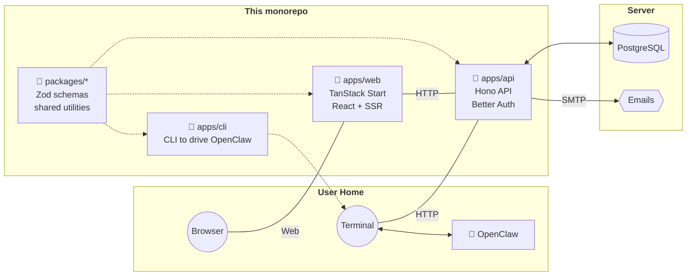

# Welcome to our documentation 🦋

## What is Kaja?

_Work In Progress 🚧_

## Architecture

---

## [Kaja.io Legal](#legal)

- [Privacy Policy](/privacy)
- [Terms of Service](/terms)

[Open **Configuration**](/configuration){: .btn .btn-green }
