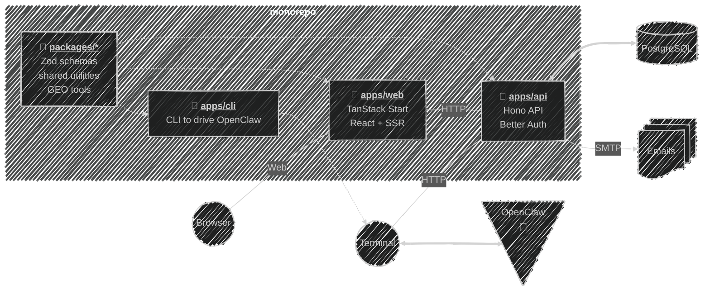

# Welcome to our documentation 🦋

## What is Kaja?

_Work In Progress 🚧_

## Architecture

## Legal

- [Privacy Policy](/privacy)
- [Terms of Service](/terms)

---

Next:

[Open the **configuration** page](/configuration){: .btn .btn-blue .fs-5 }
