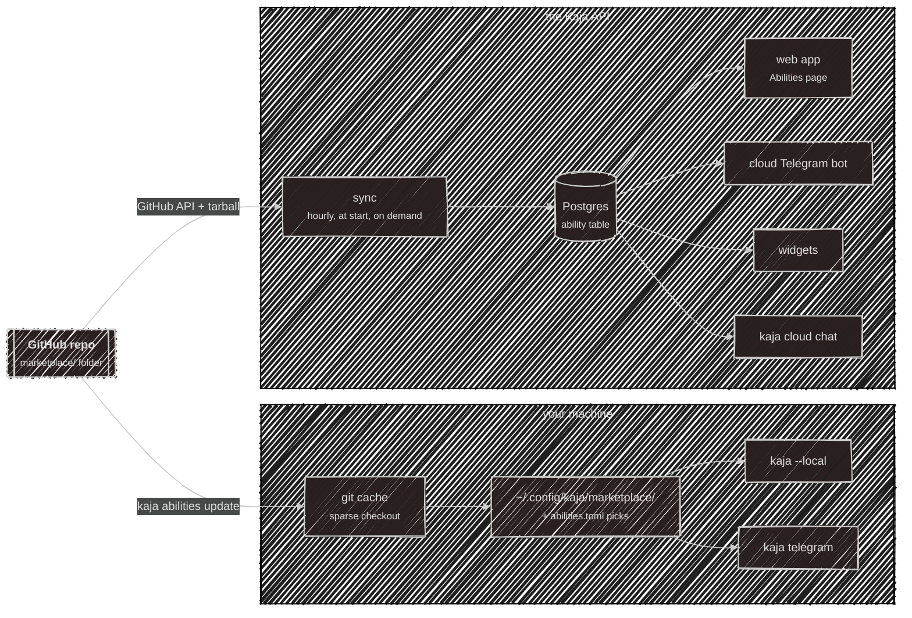
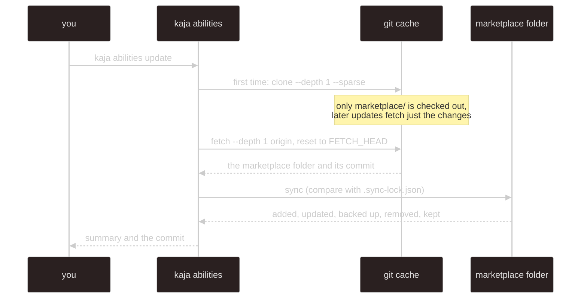
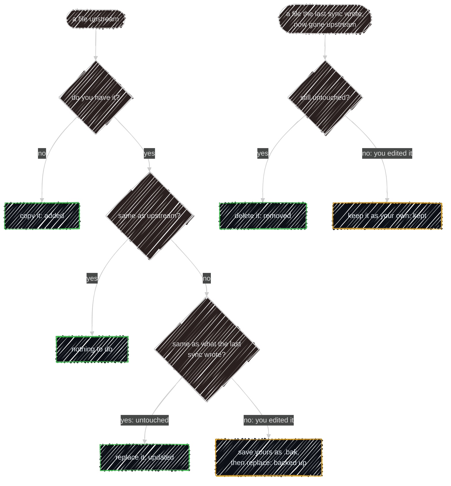
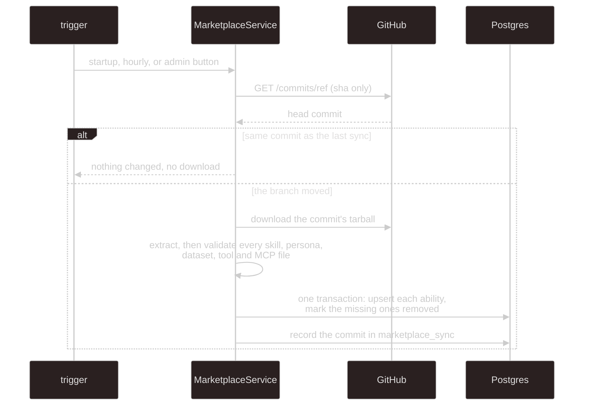
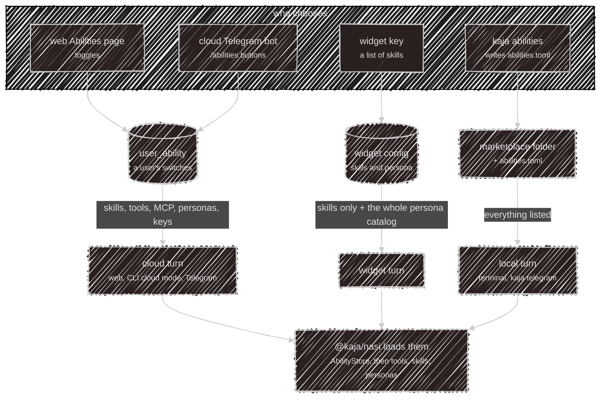

# Marketplace

The marketplace is a folder, [`marketplace/`](https://github.com/SubZtep/kaja/tree/main/marketplace), in the
Kaja repo. Everything Kaja can do beyond its built-in tools comes from there: skills, personas, HTTP tools,
MCP servers and datasets. There is no publishing flow and no registry service. The repo owner adds a file,
and two consumers copy the folder on their own schedule.



Both copies are separate and can be at different commits. The terminal never talks to the API's copy, and the
API never reads your disk.

## What's in it

```
marketplace/
├─ skills/<name>/
│  ├─ SKILL.md            # frontmatter (name, description) + instructions
│  ├─ *.md                # optional extra files the instructions point to
│  └─ scripts/            # optional scripts, run through run_command
├─ personas/<id>.toml     # label, when to switch to it, instructions, sampling
├─ datasets/<id>.json     # a questionnaire a persona fills in
├─ tools/<name>.toml      # an HTTP API: base URL, auth, the tools the model can call
└─ mcp/<name>.toml        # an MCP server: url or command, auth, approval, tool allowlist
```

| Kind | What it gives the agent | Read more |
| --- | --- | --- |
| skill | instructions it loads on demand, when a request matches the description | [Skills](/skills) |
| persona | a character with its own instructions, model and sampling | [Personas](/personas) |
| dataset | a list of questions a persona collects answers to | [Memory & Datasets](/memory#datasets) |
| tool | an HTTP API, described so the model can call its endpoints | [Tools](/tools#http-tools) |
| MCP server | tools from a Model Context Protocol server | [Tools](/tools#mcp-servers) |

Each kind has one manifest format, checked by the schemas in
[`@kaja/schema/abilities`](/development/schema#kajaschemaabilities). The rules that matter most:

- **Names.** A skill's `name` must match its folder, a tool's or MCP server's must match its file name, and a
  persona's id is its file name. Lowercase letters, digits and single hyphens, up to 64 characters.
- **Keys never go in a file.** A tool's `auth` only says *where* a key goes (which header or query
  parameter); the user's key lives in their own [`secrets.toml`](/configuration/secrets) locally, or encrypted
  on the server in the cloud.
- **Anything but `GET` asks first.** An HTTP tool call that could change something, and an MCP server set to
  `approval = "writes"`, wait for the user's OK.
- **Text only.** Binary files, hidden files and `.bak` backups are never shown to the model.

A file that fails validation is skipped with a warning by whoever reads it. It never stops the rest of the
marketplace from loading.

The folder's own [README](https://github.com/SubZtep/kaja/blob/main/marketplace/README.md) is the reference for
writing an entry.

## In the terminal

Local mode reads plain files and touches the network in exactly one place: `kaja abilities update`.

### Fetching



- **Needs `git` 2.25 or newer** on your machine (the checkout uses `clone --sparse`). The fetch checks the version first and
  says what is wrong; `kaja doctor` shows it too. It runs with prompts off, so a private or mistyped URL fails instead of
  waiting for a password, and every git call has a two-minute timeout.
- **The source** is the Kaja repo's `main` by default. Override it in [`abilities.toml`](/configuration/config)
  with `[source] url` and `ref`; a local path works too, for testing your own changes. Changing the URL
  re-clones.
- **The first `kaja abilities`** (no update yet) runs the update once before showing the picker. Nothing else
  fetches: starting Kaja only reads the folder.

### Syncing without losing your edits

Each sync compares three things per file: the upstream copy, your copy, and the hash recorded by the previous
sync in `.sync-lock.json`.



Files you added yourself are never touched, and the sync keeps script permissions (the executable bit) and
prunes folders it emptied. Backups are `.bak`, then `.bak2`, `.bak3`, and so on.

### Choosing what loads

Syncing only puts files on disk. Nothing loads until it is listed in `~/.config/kaja/abilities.toml`, which
the `kaja abilities` picker writes: your own skills and tools follow the same rule as synced ones. Personas
work the same way, except `default`, which always loads (built in, unless you ship your own `default.toml`).

At startup the terminal reads only the listed files:

- **skills** are listed in the system prompt by name and description, and the model loads one with
  `load_skill` when a request fits;
- **HTTP tools and MCP servers** become tools, marked `community` next to the built-ins (see
  [names and origins](/tools#names-and-origins)), with keys taken from `secrets.toml` under
  `[abilities.<name>]`;
- **personas** join the roster the key bar's picker and `switch_persona` use;
- **datasets** are read when a persona names one.

Local mode is the most permissive: skills with `scripts/`, stdio MCP servers and hosts on your own network
all work, because everything runs on your machine.

## In the cloud

The API keeps its own copy in the `ability` table (see the [Database](/development/database#server-config-and-abilities)
page), so cloud chat, the web app, Telegram and widgets never touch git or the repo at request time.

### Syncing



- **Triggers.** Once at API start-up (in the background), every hour on the hour, and from the **Sync now**
  button admins see on the [Abilities page](https://kaja.io/abilities). Only one sync runs at a time.
- **Cheap when idle.** The check is one small, unauthenticated GitHub API call, so the repo must be public.
  The tarball (capped at 50 MB) is only downloaded when the branch head moved.
- **Which repo.** `MARKETPLACE_REPO` (default `SubZtep/kaja`) and `MARKETPLACE_REF` (default `main`).
- **Failures are recorded.** A failed sync writes its error to the single `marketplace_sync` row, which the
  admin panel shows next to the last synced commit, and reports it to Sentry. The previous catalog stays in
  place.
- **Nothing is deleted.** An ability that leaves the folder gets `removed_at` instead. Users' selections
  survive, and come back if it returns. A row's `updated_at` only moves when its content hash changes, and
  the hash covers just what the agent sees.

### What the cloud leaves out

The cloud runs on a server without a shell, next to other people's data, so it offers less than local mode.
An ability that doesn't qualify is skipped at sync time, and one that stops qualifying later is hidden from
the catalog:

| Kind | Not offered in the cloud when |
| --- | --- |
| skill | it has a `scripts/` folder (there's no shell to run them) |
| tool | its `baseUrl` is not a public address, or it needs a key and the server can't store keys |
| MCP server | it is `stdio`, has no `tools` allowlist, is on a non-public host, or shares a name with an HTTP tool (a key belongs to one name) |
| any | its manifest no longer parses |

Datasets are synced too, but never listed or toggled: they come with the personas that use them. The `default`
persona is always on and isn't listed either.

## How the apps use it

One catalog, several front doors. What differs is who chooses the abilities and what a turn is allowed to
use.



| Front door | Where the choice is stored | What a turn gets |
| --- | --- | --- |
| **Terminal, local mode** | `abilities.toml` and your `marketplace/` folder | every listed skill, tool, MCP server and persona, plus your `secrets.toml` keys |
| **Terminal, cloud mode** | your account's `user_ability` rows | the cloud agent: nothing runs locally. `kaja abilities` only points you to the web page |
| **Web Abilities page** | `user_ability` rows, saved on each toggle | the same, in web chat and CLI cloud chat |
| **Cloud Telegram bot** | the same `user_ability` rows | `/abilities` lists the catalog as buttons: ✅ on, ▫️ off, 🔑 needs a key first. Keys are entered on the web page, never in chat |
| **Local Telegram bot** | `abilities.toml` | what the terminal loads. It builds its tools once at start, so restart it after `kaja abilities` |
| **Widgets** | the key's own `skills` list | skills only, so a visitor never triggers a tool or MCP call with the owner's key, but every persona in the catalog is available, starting from the key's |

Whichever door a turn comes in through, [`@kaja/nasi`](/development/nasi#abilities) does the loading: it asks
an `AbilityStore` (the folder on disk, or the Postgres copy) for the enabled abilities and turns them into
tools, skills in the system prompt and roster personas. A skill or persona change reaches a conversation that's
already going from its next message, because the prompt's skill and persona sections are rebuilt every turn.

### Keys

A tool or MCP server that needs a key asks for it before you can turn it on. Locally the key lives in
`secrets.toml`. In the cloud it is tested with the manifest's `check` request, stored encrypted per user, and
never sent back to the browser: the page only shows "Key saved". Details are on the
[Tools](/tools#http-tools-in-the-cloud) page.

## Adding to the marketplace

Only the repo owner adds entries, by committing files under `marketplace/` (a merged pull request counts).
To try one before it is merged:

1. Put it in a copy of the repo, in the folder for its kind, following the
   [marketplace README](https://github.com/SubZtep/kaja/blob/main/marketplace/README.md).
2. Point your local Kaja at that copy in `abilities.toml`: `[source]` with `url` set to its path and `ref` to
   its branch, then run `kaja abilities update` and enable it with `kaja abilities`.
3. `kaja doctor` lists every loaded tool by origin, plus anything that was left out and why.

Once the change is on the configured branch, local users get it with their next `kaja abilities update`, and the
cloud catalog picks it up within the hour (or when an admin presses **Sync now**).

---

Next:

[Personas](/personas){: .btn .btn-green .fs-5 }
