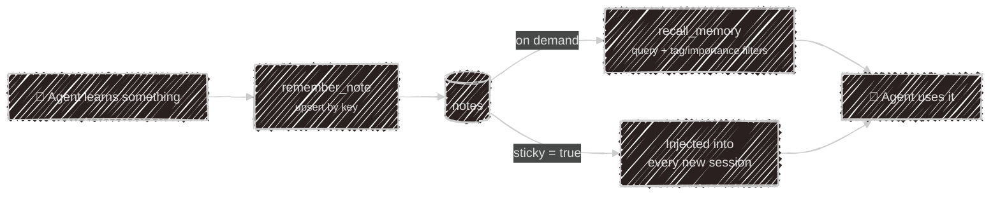

# Memory & datasets

Two different kinds of remembering, both persisted in the same
[store](/tui/sqlite) (SQLite locally, Postgres when hosted).

| | **Notes** | **Datasets** |
|---|---|---|
| Shape | free-form facts | a fixed list of fields |
| Written by | the agent, unprompted | the user, one answer at a time |
| Read back | by search (`recall_memory`) | as a completed version |
| Defined where | nowhere — grows organically | `~/.config/kaja/datasets/*.json` |

## Notes

The agent writes notes proactively whenever it learns something durable about you or your work —
it doesn't ask permission first.

Each note has a **key** (a stable id like `user:communication-style`), the **content**, an
**importance** of `low`/`medium`/`high` that weights recall ranking, optional **tags**, and a
**sticky** flag.



| Tool | What it does |
| --- | --- |
| `remember_note` | write or update a fact — **upserts by key**, so calling again with the same key overwrites rather than duplicating |
| `recall_memory` | search notes; filters by tags, minimum importance, or sticky-only |
| `list_notes` | enumerate what's stored |
| `forget_note` | delete one note by key, or every note carrying a tag |

**Sticky** notes skip the search step entirely — they're injected into the system prompt at the
start of every session. Use them for the handful of things that should always be in context; leave
everything else non-sticky so it's recalled only when relevant.

You can ask for any of this in plain language: *"what do you remember about me?"*, *"forget the
note about my old job"*.

## Datasets

A dataset is a questionnaire the agent fills in conversationally, across as many sessions as it
takes. One JSON file per topic in `~/.config/kaja/datasets/`, and a [persona](/personas) opts into
it with `dataset = "<id>"`.

```json
{
  "label": "Onboarding",
  "revalidateAfterDays": 365,
  "fields": [
    { "name": "favorite_color", "prompt": "What's your favorite color?" },
    { "name": "timezone", "prompt": "What timezone are you in?" },
    {
      "name": "notification_pref",
      "prompt": "How do you want to be notified — email, push, or none?",
      "accepted": ["email", "push", "none"]
    }
  ]
}
```

| Field | Purpose |
| --- | --- |
| `label` | display name (required) |
| `fields[].name` | the stored key (required) |
| `fields[].prompt` | what to ask — the agent rephrases it naturally rather than reading it out |
| `fields[].accepted` | fixed answer list; anything else is rejected case-insensitively and re-asked |
| `revalidateAfterDays` | how long a completed set stays fresh before a new version is started |

### Versions

Answers are grouped into **versions**. When a set is complete it's stamped with a completion time;
once `revalidateAfterDays` has passed, the next check transparently opens a fresh version and the
agent asks everything again. That's what makes a mood or check-in questionnaire useful over time —
each version is a dated snapshot you can compare against the last.

The agent drives all of this through one tool, `dataset_info`, with four actions:
`list_datasets`, `get_status` (progress, and what's still unanswered), `answer` (record one field),
and `start_new_version` (redo the set early, when you ask).

---

Next:

[Telegram](/telegram){: .btn .btn-green .fs-5 }
