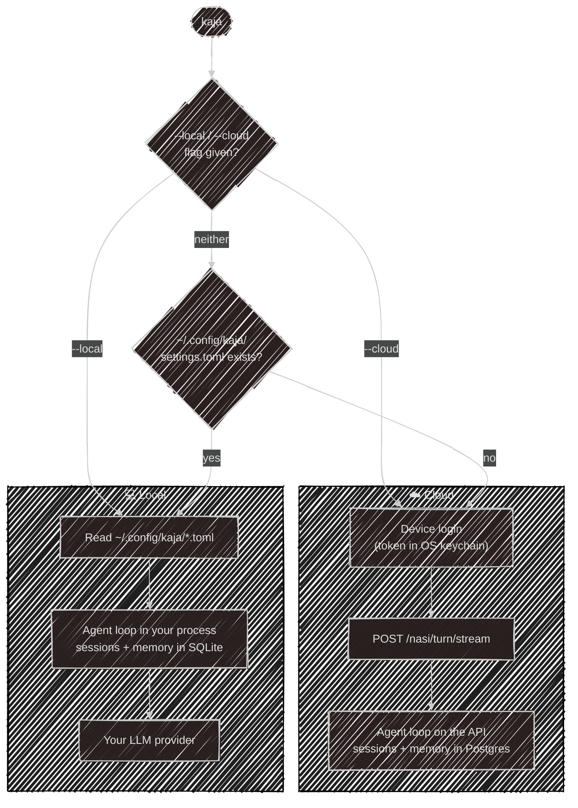

# Cloud vs local

Kaja is one CLI with two ways to get an answer. The difference is *where the agent loop runs*.



## Auto-detect

With **no flag**, the mode is picked for you:

- a local config exists (`~/.config/kaja/settings.toml`) → **local**
- no config → **cloud**

Force either one explicitly:

```sh
kaja --local     # local agent loop, even with no config yet (runs first-run setup)
kaja --cloud     # cloud login, even if a local config exists
```

## Cloud mode

The default for a fresh install. On first run the CLI does a **device login**: it prints a code,
you approve it in the browser at [kaja.io/device](https://kaja.io/device), and a single bearer
token is stored in your OS credential store (`Bun.secrets`, service `kaja-tui`). There is no
credentials file on disk.

Only one cloud account can be signed in at a time. `kaja logout` clears the token.

> If the OS keychain is unavailable, cloud mode errors out and recommends `--local` — there is no
> plaintext fallback.
{: .warning }

What cloud mode **does not** have:

- no local SQLite, no `~/.config/kaja` files
- no shell (`run_command`), no file tools, no MCP servers, no plugin tools
- no persona or model switching from the `/` menu — the server picks from an admin-managed
  persona catalog and resolves the model

Everything else — memory notes, datasets, `ask_user`, web search, image generation — works, scoped
to your account. See [Cloud API](/development/api) for the endpoints.

## Local mode

The full agent. The loop, the tools, and the storage all run in your process:

- config from `~/.config/kaja/` ([Configuration](/configuration))
- sessions, memory notes, and dataset answers in a SQLite file ([Storage](/tui/sqlite))
- your own provider from `models.toml` — there is **no** silent fallback to cloud free chat; if
  no chat model is configured, the CLI exits with an error
- local tools on: files, shell, MCP, plugins
- `fetch_url` fetches under your own network identity — the server's `WEB_PROXY` does not apply
  here ([Tools](/tools#built-ins))
- `-c` / `--continue` and `-s <id>` / `--session <id>` to resume a conversation

Both modes share the same agent core (`@kaja/nasi`), the same tool contracts, and the same
[Flow](/flow).

---

Next:

[Configuration](/configuration){: .btn .btn-green .fs-5 }
