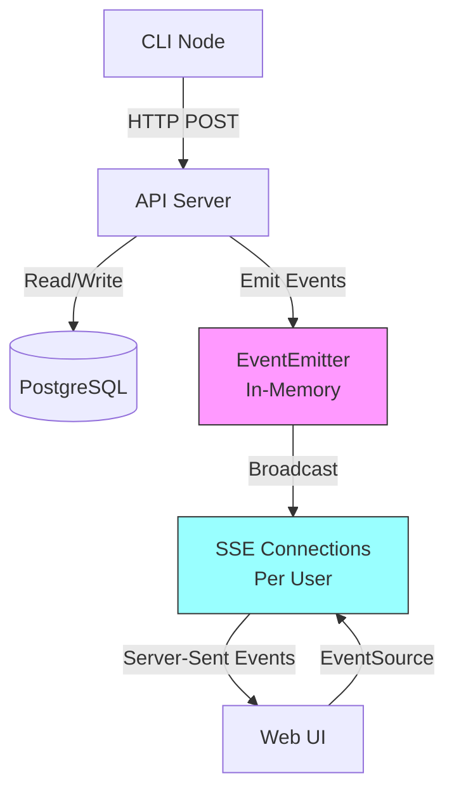
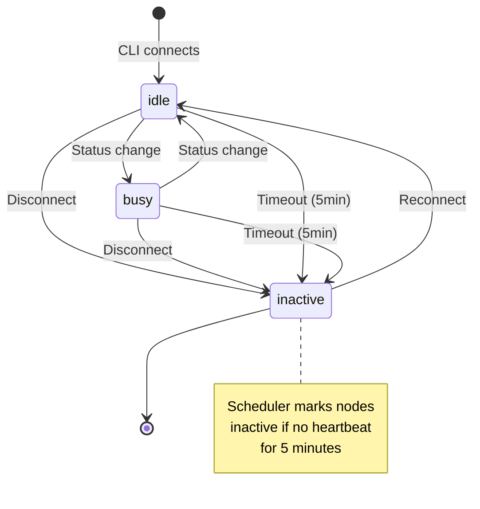
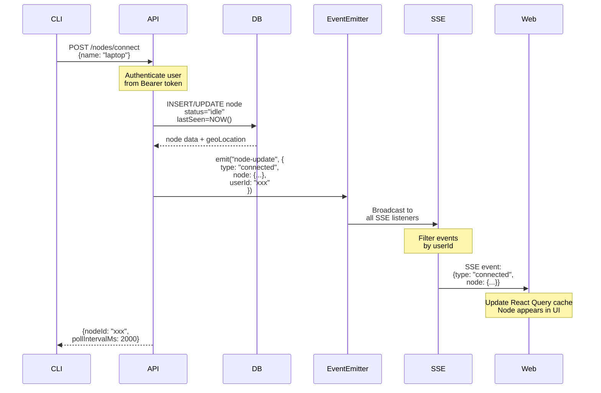
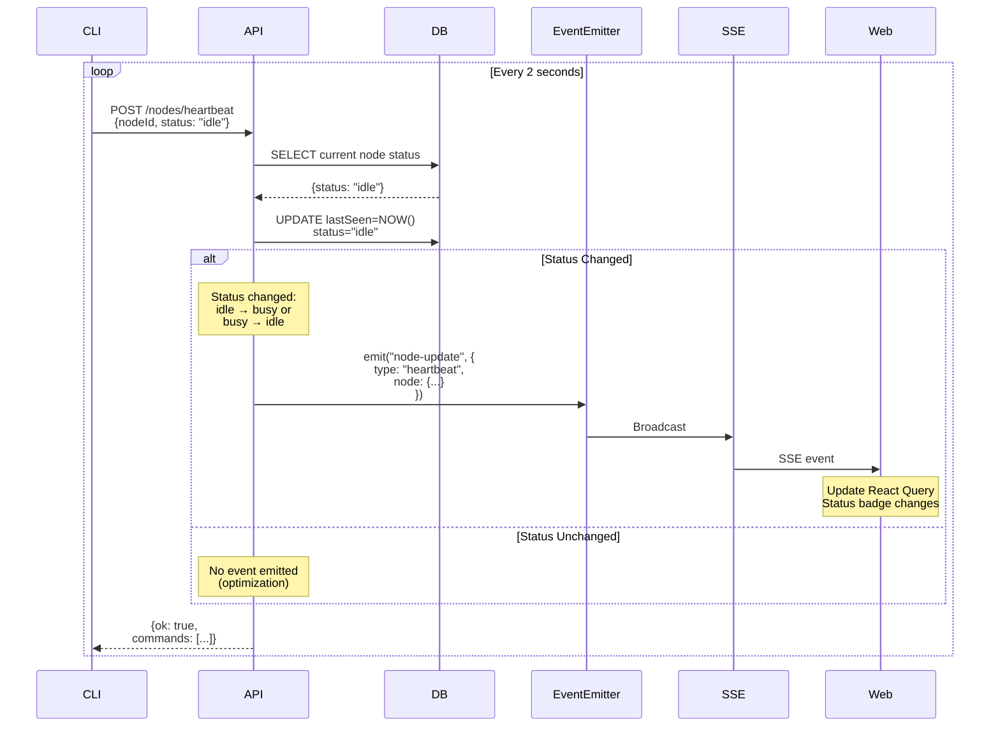
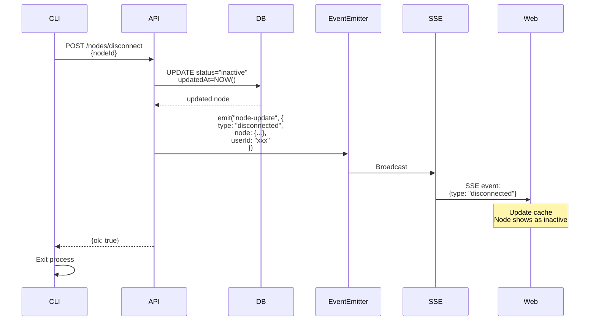
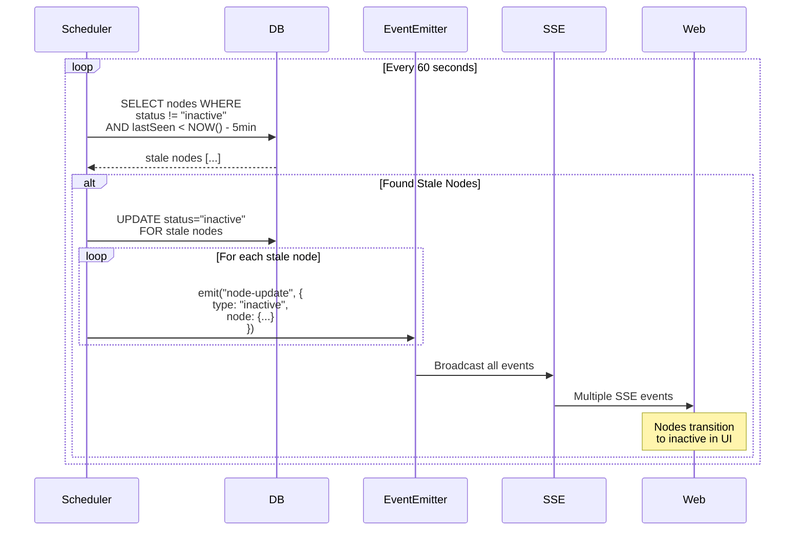
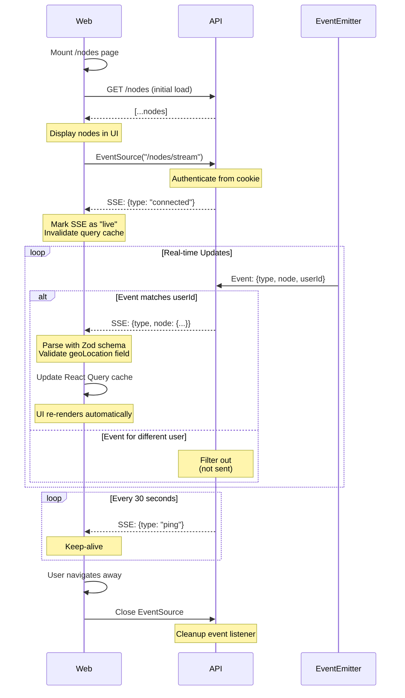
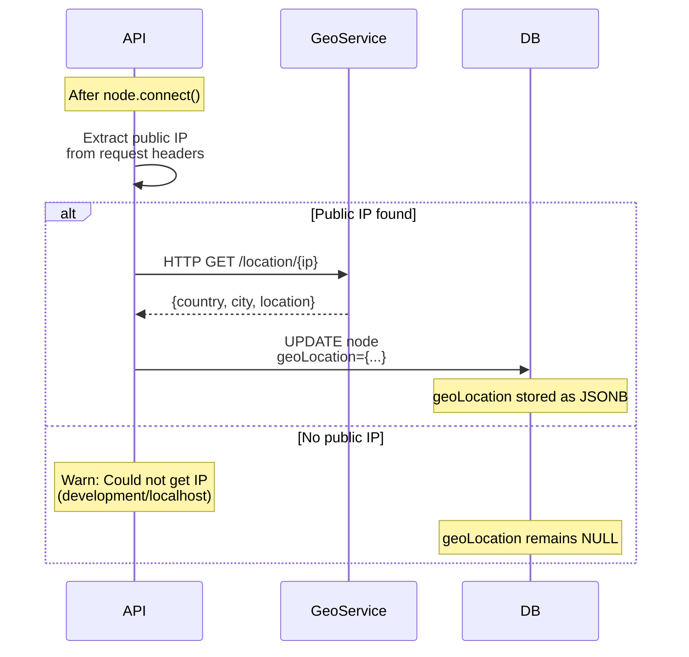

# Node Communication Architecture

This document describes how CLI nodes communicate with the API and how real-time updates propagate to the web UI.

## System Overview



### Key Components

- **CLI**: Bun-based command-line tool running on user machines
- **API**: Hono server with REST endpoints and SSE streaming
- **EventEmitter**: Node.js in-memory event bus (single process only)
- **SSE**: Server-Sent Events for real-time updates (filtered by userId)
- **Web UI**: React app with TanStack Query + SSE hooks
- **Database**: PostgreSQL

## Node Lifecycle



### Node Statuses

- **`idle`**: Node is connected and available
- **`busy`**: Node is executing a command
- **`inactive`**: Node disconnected or timed out

## 1. CLI Connect Flow

**Triggered**: When user runs `kaja` CLI command



### Code References

- **CLI**: `apps/cli/src/cli.tsx` - Connection logic
- **API Route**: `apps/api/src/features/nodes/connect.ts`
- **Service**: `apps/api/src/services/node.ts:16` - `connectNode()`
- **Event Emission**: `apps/api/src/services/node.ts:40-44`
- **SSE Endpoint**: `apps/api/src/features/nodes/stream.ts:30-46`
- **Web Hook**: `apps/web/src/routes/_admin/nodes/-components/use-node-sse.ts:59-110`

## 2. CLI Heartbeat Flow

**Triggered**: Every 2 seconds while CLI is running



### Important Optimization

**Events are only emitted when status changes** (node.ts:94-100). This prevents flooding SSE connections with unnecessary updates when the node is just maintaining its heartbeat.

### Code References

- **CLI**: `apps/cli/src/cli.tsx` - Heartbeat loop
- **API Route**: `apps/api/src/features/nodes/heartbeat.ts`
- **Service**: `apps/api/src/services/node.ts:71-104` - `heartbeat()`
- **Status Change Check**: `apps/api/src/services/node.ts:94`

## 3. CLI Disconnect Flow

**Triggered**: User stops CLI (Ctrl+C) or graceful shutdown



### Code References

- **CLI**: `apps/cli/src/cli.tsx` - Cleanup on exit
- **API Route**: `apps/api/src/features/nodes/disconnect.ts`
- **Service**: `apps/api/src/services/node.ts:49-69` - `disconnectNode()`

## 4. Scheduler Timeout Flow

**Triggered**: Every 60 seconds (background job)



### Timeout Configuration

- **Heartbeat Interval**: 2 seconds (CLI)
- **Inactivity Timeout**: 5 minutes (300 seconds)
- **Scheduler Interval**: 60 seconds

If a node doesn't send a heartbeat for 5 minutes, it's marked inactive on the next scheduler run.

### Code References

- **Scheduler Service**: `apps/api/src/services/scheduler.ts:44-79` - `#runTasks()`
- **Mark Inactive**: `apps/api/src/services/node.ts:106-133` - `markInactiveNodes()`

## 5. Web SSE Connection Flow

**Triggered**: When user navigates to `/nodes` page



### SSE Event Types

- **`connected`**: Initial connection established (no node data)
- **`connected`** (with node): Node connected/reconnected
- **`heartbeat`**: Node status changed during heartbeat
- **`disconnected`**: Node gracefully disconnected
- **`inactive`**: Node marked inactive by scheduler
- **`ping`**: Keep-alive message (every 30s)

### Validation & Schema

All events (except initial `connected`) are validated with Zod:

```typescript
const NodeUpdateEventSchema = z.object({
  type: z.enum(["connected", "heartbeat", "disconnected", "inactive"]),
  node: nodeSchema  // Requires ALL fields including geoLocation
})
```

**Critical**: The `geoLocation` field must be present (even if `null`) or Zod validation fails and the event is silently dropped.

### Code References

- **Web Hook**: `apps/web/src/routes/_admin/nodes/-components/use-node-sse.ts`
- **SSE Server**: `apps/api/src/features/nodes/stream.ts`
- **Event Emitter**: `apps/api/src/services/events.ts`

## 6. GeoIP Lookup Flow

**Triggered**: After node connects (background)



### GeoLocation Structure

```typescript
{
  continent?: {
    geonameId: number,
    name: string
  },
  country?: {
    geonameId: number,
    name: string
  },
  city?: {
    geonameId: number,
    name: string
  },
  location?: {
    accuracyRadius: number,
    latitude: number,
    longitude: number,
    timeZone?: string
  }
}
```

### Code References

- **Geo Client**: `apps/api/src/lib/geo-client.ts`
- **Geo Queue**: `apps/api/src/core/queue.ts`
- **Connect Route**: `apps/api/src/features/nodes/connect.ts`

## Architecture Details

### EventEmitter Pattern

The system uses Node.js's built-in `EventEmitter` for in-process event distribution:

```typescript
// Event emission (node.ts:40-44)
emitNodeEvent({
  type: "connected",
  node: connectedNode,
  userId: connectedNode.userId
})

// Event listening (stream.ts:49)
nodeEvents.on("node-update", eventHandler)
```

**Limitations**:
- ❌ Events don't persist across API restarts
- ❌ Won't work with multiple API instances (needs Redis Pub/Sub)
- ✅ Simple, fast, no external dependencies
- ✅ Perfect for single-instance deployments

### SSE vs WebSockets

We use **Server-Sent Events** instead of WebSockets because:

1. **Unidirectional**: Server → Client (we don't need Client → Server real-time)
2. **Simpler**: Native `EventSource` API in browsers
3. **Auto-reconnect**: Built-in reconnection logic
4. **HTTP/2 friendly**: Multiplexed over existing connection
5. **Easier to debug**: Plain HTTP, visible in DevTools

### React Query Integration

The SSE hook updates React Query's cache directly:

```typescript
queryClient.setQueryData(["nodes"], (oldData: Node[] | undefined) => {
  const currentData = oldData ?? []
  const existingIndex = currentData.findIndex(n => n.id === node.id)

  if (existingIndex >= 0) {
    // Update existing node
    const newData = [...currentData]
    newData[existingIndex] = node
    return newData
  }

  // Add new node
  return [...currentData, node]
})
```

This triggers automatic re-renders without manual state management.

## Testing

Integration tests verify the complete event flow:

**File**: `apps/api/tests/integration/sse.test.ts`

**Tests**:
1. ✅ Connect emits "connected" event with all fields (including `geoLocation`)
2. ✅ Heartbeat emits event only when status changes
3. ✅ Heartbeat with unchanged status doesn't emit event
4. ✅ Disconnect emits "disconnected" event
5. ✅ Scheduler emits "inactive" events
6. ✅ Events are filtered by userId

Run tests: `bun run test`

## Troubleshooting

### Node stuck in old status

**Symptoms**: CLI stops but web UI still shows node as active

**Causes**:
- SSE connection dropped (check browser console)
- Event validation failed (missing `geoLocation` field)
- EventEmitter listener not registered

**Fix**: Refresh page to reconnect SSE

### SSE connection keeps reconnecting

**Symptoms**: "Live" indicator flashing on/off

**Causes**:
- API server restarting
- Network issues
- CORS configuration (check `CORS_ORIGIN` env var)

**Fix**: Check API logs for errors

### Events not received for some users

**Symptoms**: User A sees updates, User B doesn't

**Causes**:
- userId filtering in SSE (check `stream.ts:32`)
- Authentication issue (Bearer token expired)

**Fix**: Check if `user.id` matches `node.userId` in database

## Performance Considerations

### Memory Usage

Each SSE connection holds:
- EventSource connection (client)
- Event listener function (server)
- Ping interval timer (server)

**Estimated**: ~1KB per connection

For 1000 concurrent users: ~1MB memory

### Network Traffic

- **Heartbeat**: 2 req/sec per node (minimal payload)
- **SSE**: Variable (only sends when events occur)
- **Ping**: 1 event per 30 seconds per connection

**Optimization**: Status change detection prevents unnecessary SSE traffic

### Database Load

- **Heartbeat**: 2 writes/sec per active node
- **Scheduler**: 1 query every 60 seconds
- **Connect/Disconnect**: Infrequent

**Optimization**: Use database connection pooling (already configured)

## Future Improvements

### Multi-Instance Support

To run multiple API instances, replace EventEmitter with **Redis Pub/Sub**:

```typescript
// Instead of EventEmitter
const redis = new Redis()

// Emit
await redis.publish("node-updates", JSON.stringify(event))

// Listen
await redis.subscribe("node-updates")
redis.on("message", (channel, message) => {
  const event = JSON.parse(message)
  // Broadcast to SSE connections
})
```

### Persistent Events

Store events in database for audit log and replay:

```sql
CREATE TABLE node_events (
  id UUID PRIMARY KEY,
  node_id UUID REFERENCES node(id),
  type TEXT NOT NULL,
  data JSONB NOT NULL,
  created_at TIMESTAMPTZ DEFAULT NOW()
);
```

### GraphQL Subscriptions

Replace SSE with GraphQL subscriptions for more flexible filtering:

```graphql
subscription onNodeUpdate($userId: ID!) {
  nodeUpdated(userId: $userId) {
    id
    name
    status
    lastSeen
  }
}
```
