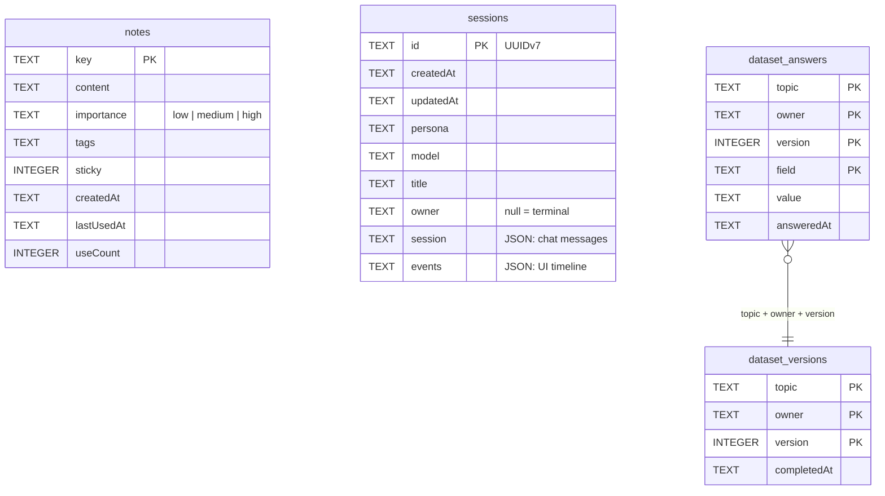

# Local storage

In [local mode](/modes) everything Kaja remembers lives in one SQLite file on your machine —
`~/.local/share/kaja/` by default (XDG), overridable with `[memory] dbPath` in
[`settings.toml`](/configuration/config). `kaja config paths` prints the resolved location.

It opens in WAL mode, so it's safe to have the terminal chat and the Telegram bot running at once.

In hosted mode there is no local database — the same four tables live in the server's Postgres,
scoped to your account.

## Tables

| Table | Holds |
| --- | --- |
| `notes` | the agent's long-term [memory](/memory) about you |
| `sessions` | full conversation transcripts, resumable with `-c` / `-s` |
| `dataset_answers` | individual answers to a [dataset](/memory#datasets) field |
| `dataset_versions` | marks a dataset as completed at a point in time |

`owner` namespaces rows within one file: `null` for the terminal, a namespaced id for a Telegram
user or a widget visitor. Sessions belonging to a different owner cannot be resumed.

## Deleting it

Closing Kaja and deleting the file wipes all memory and history — there's nothing else to clean
up. `kaja config wipe` handles the config directory but leaves this file alone.
