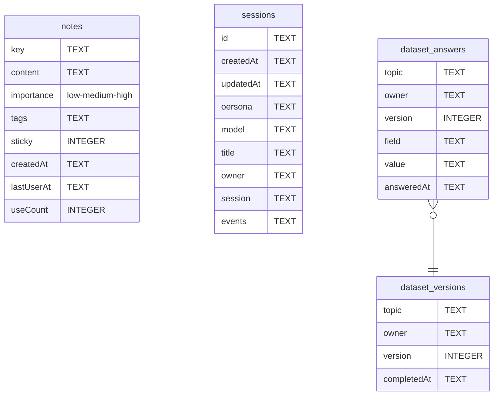

# SQLite

Sensitive user data.

## Tables

- **notes** — Agent’s memory about the user
- **sessions** — Chat log
- **dataset_answers** — User answers
- **dataset_versions** — Groups individual key-value answers into complete, timestamped versions for each topic and owner

## Schema

