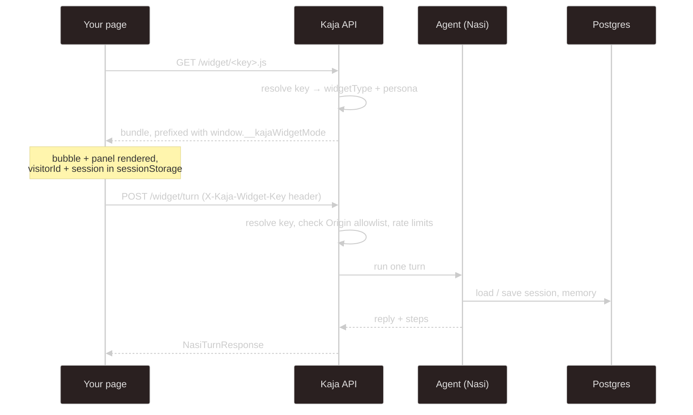

# Website widget

Put Kaja on your own site with one script tag. The widget renders a chat bubble in the corner; the
agent behind it runs on the Kaja API against your account.

```html
<script src="https://api.kaja.io/widget/<widget-key>.js"></script>
```

No data attributes, no configuration in the page. Everything — which persona answers, which UI
renders, which origins may embed it — is bound to the key and resolved server-side.

## Getting a key

Create one from the **Widget** page of the [web app](/web-app):

1. Give it a **label** (so you can tell your keys apart).
2. List the **allowed origins** — the sites permitted to embed it. At least one is required.
3. Pick a **type** (`chat` or `barkochba`) and, optionally, a **persona** and the **skills** it may use.

You can change a key's label, origins, persona and skills later from the same page; the key itself never
changes.

The raw key is shown **once, at creation**, and never again — the server only stores a hash and a
short prefix for display. Lose it and you create a new one.

## How it works



The widget key in the script URL is also what identifies the caller on `POST /widget/turn`, sent as
an `X-Kaja-Widget-Key` header. The bundle derives the API origin from its own `src`, so there's
nothing else to wire up.

Visitor state (`visitorId`, `session`) is kept in `sessionStorage`, not cookies. Each visitor's
sessions, memory notes and dataset answers are kept apart inside your account: visitors never see each
other's, and none of it mixes into your own.

## What the agent can do

A widget turn runs in [cloud mode](/modes#cloud-mode) with the cloud [built-in tools](/tools#built-ins),
but no HTTP tools or MCP servers: a key's abilities are **skills only**, so a visitor can never make a
call with your API keys. Every persona in the catalogue is available, starting from the key's own.

## Types

| Type | UI |
| --- | --- |
| `chat` | a normal chat bubble and panel |
| `barkochba` | the Twenty Questions game front-end |

The type is independent of the persona — the persona decides *how the model behaves*, the type
decides *what the page renders*. `kaja.io` runs the `barkochba` widget on its landing page.

## Limits and safety

- **The key is not a secret** — it's visible in your page's source. The real boundary is the
  `Origin` check: a turn from an origin that isn't on the key's allowlist is rejected with 403.
  Keep that list tight.
- The embed and turn routes are deliberately exempt from the API's single fixed `CORS_ORIGIN`
  (they live on third-party pages) and reflect the request origin instead. That's safe because the
  flow carries no cookies — the key header is the only credential.
- Both the key lookup and the turn endpoint are rate-limited.
- Turns for one visitor are serialized, so a fast double-send can't interleave.
- A key can be disabled or deleted from the Widget page at any time.

---

Next:

[Voice & language](/voice){: .btn .btn-green .fs-5 }
