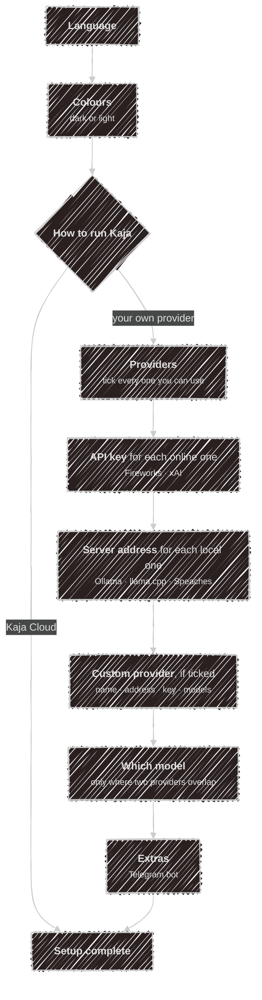

# Setup wizard

The first time you run `kaja`, it asks you a few questions to get set up. This is the setup wizard.
It takes about a minute, and you can run it again whenever you like with `kaja config wizard`.

Every question starts with an answer already picked, so pressing <kbd>Enter</kbd> is always a safe
choice. When you run the wizard again, it starts on the answers you gave last time.

## Before you start

- **For Kaja Cloud** you need nothing. You sign in with your browser once the wizard is done.
- **For your own provider**, have its API key at hand (Fireworks, xAI), or make sure your local
  server is running (Ollama, llama.cpp, Speaches). You can skip a key and add it later.

## Moving around

| Key | What it does |
| --- | --- |
| <kbd>↑</kbd> <kbd>↓</kbd> | Move through a list |
| <kbd>Space</kbd> | Tick or untick an item, in a list where you can pick several |
| <kbd>Enter</kbd> | Confirm the answer and go to the next question |
| <kbd>Esc</kbd> | Cancel the whole wizard (on a list) — nothing is saved |

Where you type an answer, pressing <kbd>Enter</kbd> on an empty field skips it; an address keeps the
usual one that's already filled in.

Your answers stay on screen with a ✓ as you go, so you can see what you've chosen so far.

## The questions

1. **Language.** The language Kaja talks to you in. The rest of the wizard switches to it straight
   away.
2. **Colours.** Pick the one that reads best on your terminal: dark or light background. Moving the
   highlight previews it; Kaja starts on the one that matches your terminal. You can switch later in
   the chat with <kbd>Alt</kbd>+<kbd>D</kbd> (see [Colours](/tui#colours)).
3. **How to run Kaja.**
   - **Kaja Cloud** (the default): nothing else to set up. After the wizard, Kaja shows a code, you
     approve it in your browser, and you're chatting. Abilities, personas and models are chosen on the
     [web app](/web-app).
   - **Your own provider**: Kaja runs on your machine, using the AI models you choose. The next
     questions set them up.

   Starting with `kaja --cloud` or `kaja --local` answers this for you, so it isn't asked.
4. **Providers.** Tick every provider you can use (at least one), then press <kbd>Enter</kbd>:
   - **Fireworks** and **xAI** run online: you're asked for the API key.
   - **Ollama**, **llama.cpp** and **Speaches** run on your machine: you're asked where the server
     listens, with the usual address already filled in. Speaches handles speech in and out, for
     [voice](/voice).
   - **Custom** is any other server with an OpenAI-compatible API (LM Studio, vLLM, a proxy). You
     give it a name, its address and a key, then each model's id and what it's for. Press
     <kbd>Enter</kbd> on an empty model id when you've listed them all.
5. **Which model.** Only asked when two of your providers can do the same job, say chat: pick which
   one does it.
6. **Extras.** Optional. Tick **Telegram bot** to chat with Kaja from [Telegram](/telegram), and
   paste the bot's token next. Press <kbd>Enter</kbd> with nothing ticked to skip.
7. **Setup complete.** Press <kbd>Enter</kbd> to finish. The screen says what happens next.

A key you type is hidden as you type it and never shown again. It's tested before it's saved (see
below).

## After the last question

With **Kaja Cloud**, that's it. The first time, Kaja goes straight on to sign you in; after
`kaja config wizard`, run `kaja` to sign in.

With **your own provider**, Kaja finishes setting up first, and may ask a few more things:

1. **Marketplace.** Whether to use the online [marketplace](/abilities) of skills, personas and
   tools. It needs `git`, and downloads it once. Then whether to keep it up to date automatically
   (see [`[marketplace]`](/configuration/config#marketplace)).
2. **Starter abilities.** Everything in the marketplace that needs no key and runs no program on
   your machine is switched on, so there's something to try straight away. `kaja abilities` picks
   from the rest. This only happens when no ability is switched on yet.
3. **Model downloads.** If your Ollama server doesn't have the models yet, one question covers
   all of them.
4. **Keys are tested.** Each key is saved only once the service accepts it; if it's turned down, Kaja
   asks whether to save it anyway. Keys that only the finished setup turns out to need, such as an
   ability's, are asked for here.
5. **Models are tested.** Every model is tried once, the same check
   [`kaja doctor`](/configuration#checking-keys-and-models) runs. If one doesn't answer and another
   can do its job, you're offered the switch.

The first time, the chat starts right after this. When you ran `kaja config wizard`, you're back at
your prompt.

## Where your answers are saved

Everything is plain text in `~/.config/kaja/`, which you can edit by hand afterwards:

| You answer | It becomes | In |
| --- | --- | --- |
| Language | `[preferences] locale` | [`settings.toml`](/configuration/config) |
| Colours | `[preferences] theme` | `settings.toml` |
| How to run Kaja | `[preferences] mode` | `settings.toml` |
| Providers you tick, custom provider | `[providers.<name>]` tables and their models | [`models.toml`](/configuration/models) |
| Which model, per task | `[models.chat]` etc.; the others stay as `[models.<provider>-chat]` | `models.toml` |
| A server address | `[providers.<name>] base_url` | `models.toml` |
| Speaches address | `[stt] speachesUrl`, `[tts] speachesUrl` | `settings.toml` |
| A provider's API key | `[providers.<name>] api_key` | [`secrets.toml`](/configuration/secrets) |
| Telegram bot token | `[telegram] botToken` | `secrets.toml` |

## Running it again

`kaja config wizard` starts on your current setup, so holding <kbd>Enter</kbd> changes nothing.
It rewrites `models.toml` from your answers, though, so keep a copy of anything you edited there by
hand. It never touches `mcp.toml`, your `tools/*.ts`, or an `abilities.toml` that already switches
something on.

The provider list is built into Kaja, so the wizard itself needs no internet connection. Without a
terminal (input piped in, or `--headless`), it asks nothing and writes the default config files if
there are none yet.

---

Next:

[Terminal UI](/tui){: .btn .btn-green .fs-5 }
