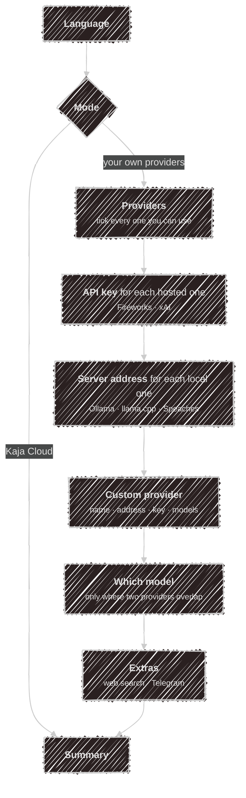

# Setup wizard

The wizard runs by itself the first time you start `kaja` in a terminal, and `kaja config wizard`
re-runs it whenever you want. It is the only thing that writes config on your behalf, and every file
it writes is plain TOML you can hand-edit afterwards. Each step opens on what you already have, so
holding <kbd>Enter</kbd> walks a configured machine through unchanged.

## The questions

- **Language** comes first and switches the rest of the wizard into it straight away.
- **Kaja Cloud** stops there: it writes a minimal `settings.toml` (language and `mode = "cloud"`), and
  abilities, personas and models are chosen on the [web app](/web-app).
- **Custom** is any other OpenAI-compatible server (LM Studio, vLLM, a proxy). It asks for a name, base
  URL, optional key, then each model's id and task until you press <kbd>Enter</kbd> on an empty one.
  There's room for one; add more by hand in [`models.toml`](/configuration/models).
- **Speaches** brings the speech-to-text and text-to-speech models; its address is written to
  [`[stt]` and `[tts]`](/voice).
- Ticking no provider leaves `models.toml` for you to write.

<kbd>Esc</kbd> on a list cancels the whole wizard. On a typed answer, an empty <kbd>Enter</kbd> skips
just that one. Nothing is tested while you answer.

## Where each answer ends up

| You answer | It becomes | In |
| --- | --- | --- |
| Language | `[preferences] locale` | `settings.toml` |
| Mode | `[preferences] mode` | `settings.toml` |
| Providers you tick, custom provider | `[providers.<name>]` tables and their models | `models.toml` |
| Which model, per task | `[models.chat]` etc.; the others stay as `[models.<provider>-chat]` | `models.toml` |
| A server address | `[providers.<name>] base_url` | `models.toml` |
| Speaches address | `[stt] speachesUrl`, `[tts] speachesUrl` | `settings.toml` |
| A provider's API key | `[providers.<name>] api_key` | `secrets.toml` |
| Web search key | `[webSearch] apiKey` | `secrets.toml` |
| Telegram bot token | `[telegram] botToken` | `secrets.toml` |

The provider catalogue is built into the binary, so a first run needs no network. Re-running the
wizard rewrites `models.toml` from your answers, so keep hand-edits in a copy.

## After the last question

A few things run before you get your prompt back:

1. **Marketplace.** Whether to use the online [marketplace](/abilities) at all (it checks `git` and
   fetches once), then whether to keep it updated automatically — see
   [`[marketplace]`](/configuration/config#marketplace).
2. **Starter abilities.** If `abilities.toml` enables nothing yet, every marketplace ability that needs
   no key and runs no command is turned on. `kaja abilities` chooses among the rest.
3. **Model downloads.** If your Ollama server is missing models `models.toml` names, one question
   covers all of them.
4. **Keys are tested before they're saved.** A key you typed is only written to `secrets.toml` once
   the service accepts it; a rejected one is saved only if you insist. Keys only the finished config
   reveals (an ability's, an MCP server's) are asked for here too.
5. **Model check.** Every model is tried once, the same check [`kaja doctor`](/configuration#checking-keys-and-models)
   runs; if a task's model fails and another one for that task answers, you're offered the switch.

The wizard never touches `mcp.toml`, your `tools/*.ts`, or an `abilities.toml` that already enables
something.

With no terminal (non-interactive stdin, or `--headless`), it writes the bundled templates untouched
and asks nothing.

---

Next:

[Terminal UI](/tui){: .btn .btn-green .fs-5 }
